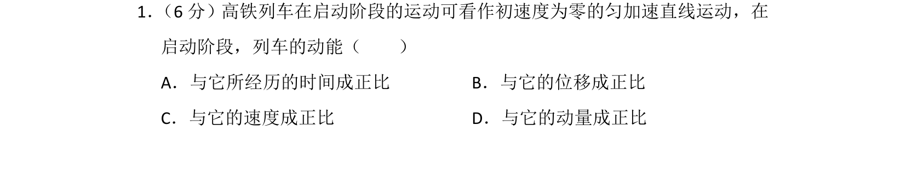
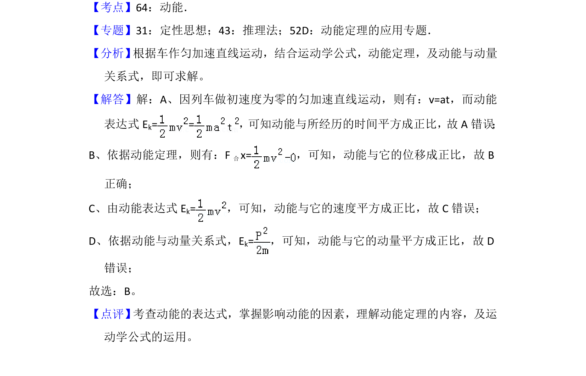

## 题面

## 摘要

高铁列车匀加速启动阶段，动能与位移成正比，与时间平方、速度平方、动量平方成正比。

## 关联考点

- [[067-动能|动能]]
- [[215-匀变速直线运动|匀变速直线运动]]
- [[251-动能定理|动能定理]]

## 答案与解析

> 📄 原 PDF 第 1 页：`素材/真题/湖南/2008-2024·（湖南）物理高考真题/2018年高考物理试卷（新课标Ⅰ）（解析卷）.pdf`

<!-- 题干文本-start -->
## 题干文本
1． （6分）高铁列车在启动阶段的运动可看作初速度为零的匀加速直线运动，在
启动阶段，列车的动能（　　）
A．与它所经历的时间成正比B．与它的位移成正比
C．与它的速度成正比D．与它的动量成正比
<!-- 题干文本-end -->

<!-- 解析文本-start -->
## 解析文本
【考点】64：动能．菁优网版权所有
【专题】31：定性思想；43：推理法；52D：动能定理的应用专题．
【分析】 根据车作匀加速直线运动，结合运动学公式，动能定理，及动能与动量
关系式，即可求解。
【解答】解：A、因列车做初速度为零的匀加速直线运动，则有：v=at，而动能
表达式E k= =，可知动能与所经历的时间平方成正比，故A错误 ；
B、依据动能定理，则有：F 合 x=，可知，动能与它的位移成正比，故B
正确；
C、由动能表达式E k=，可知，动能与它的速度平方成正比，故C错误；
D、依据动能与动量关系式，E k=，可知，动能与它的动量平方成正比，故D
错误；
故选：B。
【点评】 考查动能的表达式，掌握影响动能的因素，理解动能定理的内容，及运
动学公式的运用。
<!-- 解析文本-end -->
