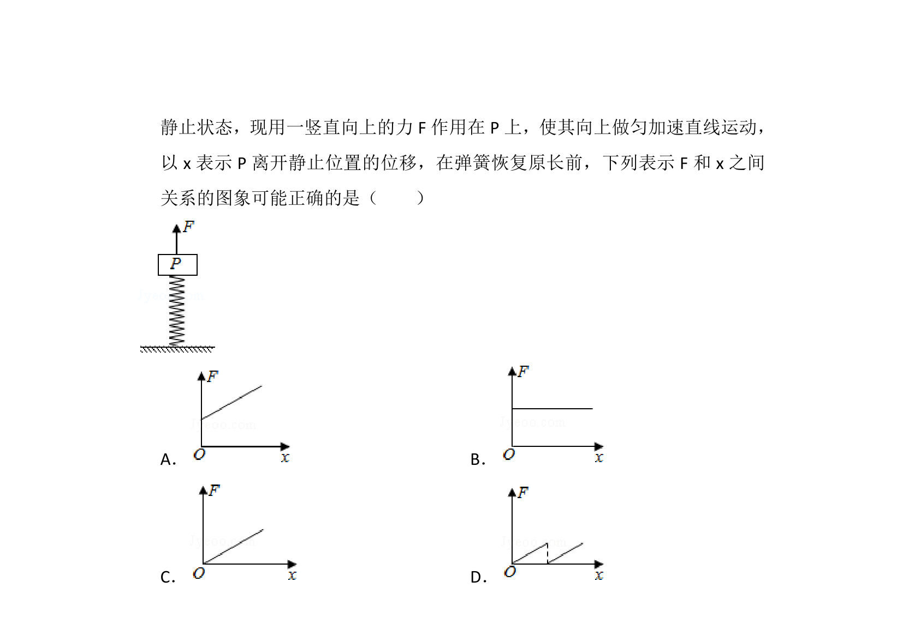
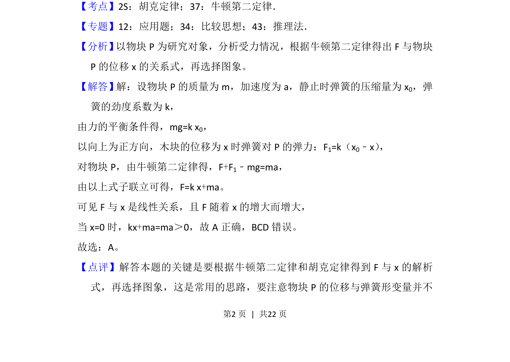

## 题面

## 摘要

物块P置于弹簧上端处于静止状态，考查弹簧弹力、平衡条件及临界状态分析

## 关联考点

- [[606-弹簧弹力|弹簧弹力]]
- [[208-共点力平衡|共点力平衡]]
- [[233-胡克定律|胡克定律]]
- [[1175-牛顿运动定律|牛顿运动定律]]

## 答案与解析

> 📄 原 PDF 第 1 页：`素材/真题/湖南/2008-2024·（湖南）物理高考真题/2018年高考物理试卷（新课标Ⅰ）（解析卷）.pdf`
