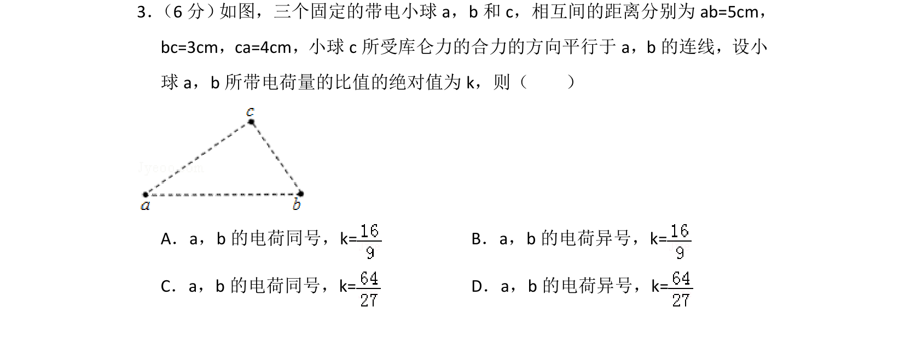
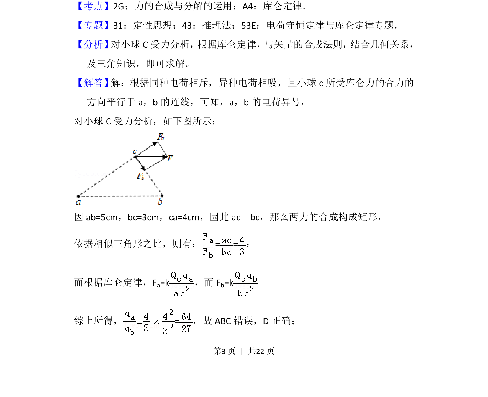
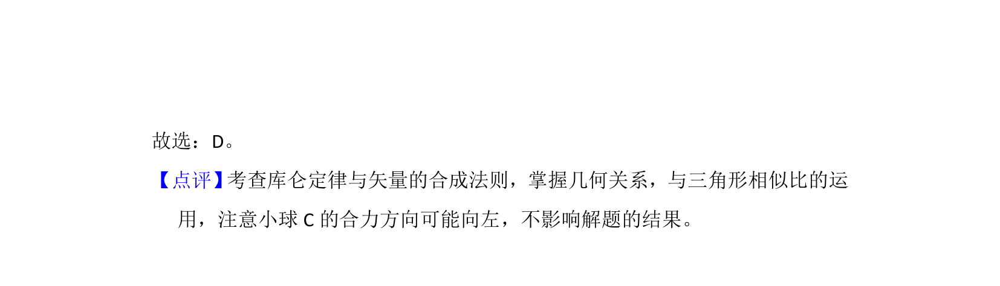

## 题面

## 摘要

三个带电小球间库仑力作用，通过受力分析与几何关系求电荷量比值及电性判断。

## 关联考点

- [[263-库仑定律|库仑定律]]
- [[532-力的合成与分解|力的合成与分解]]
- [[208-共点力平衡|共点力平衡]]

## 答案与解析

> 📄 原 PDF 第 3 页：`素材/真题/湖南/2008-2024·（湖南）物理高考真题/2018年高考物理试卷（新课标Ⅰ）（解析卷）.pdf`
