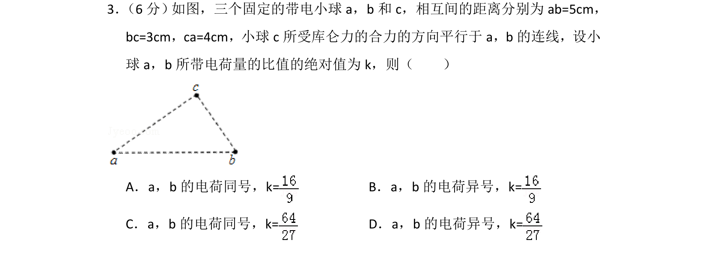
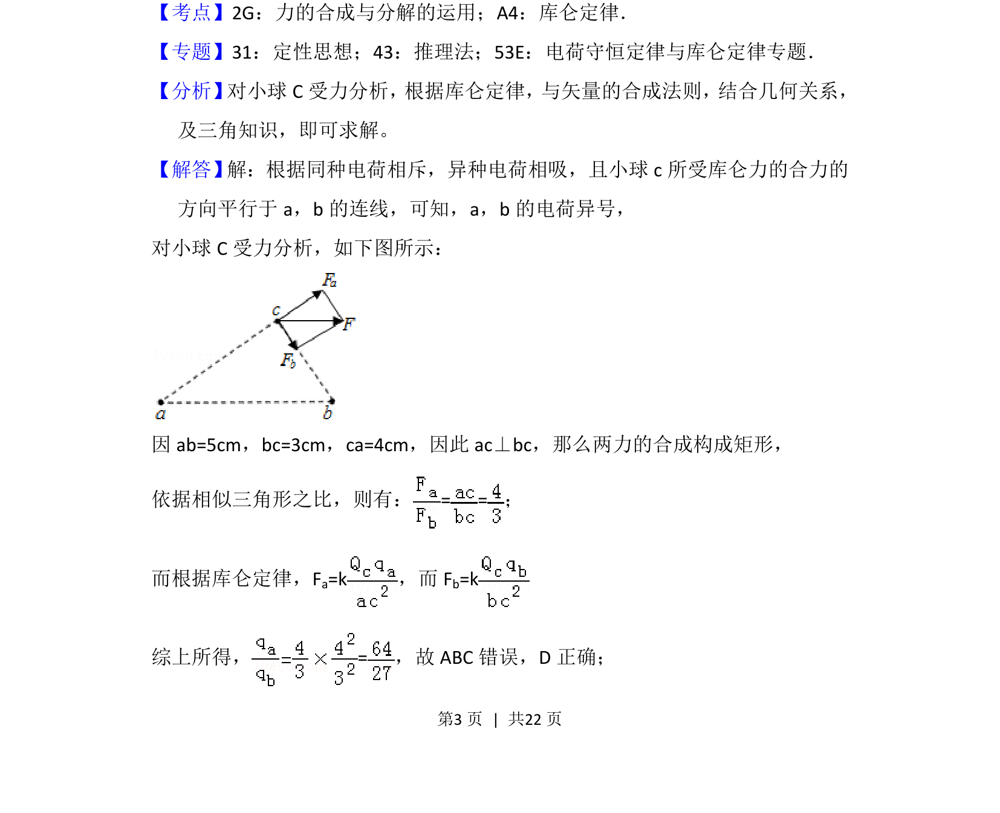
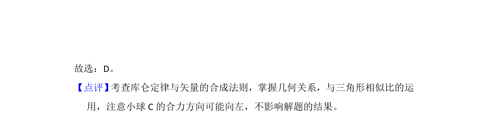

## 题面

## 摘要

三个带电小球间库仑力作用，通过受力分析与几何关系求电荷量比值及电性判断。

## 关联考点

- [[263-库仑定律|库仑定律]]
- [[532-力的合成与分解|力的合成与分解]]
- [[208-共点力平衡|共点力平衡]]

## 答案与解析

> 📄 原 PDF 第 3 页：`素材/真题/湖南/2008-2024·（湖南）物理高考真题/2018年高考物理试卷（新课标Ⅰ）（解析卷）.pdf`

<!-- 题干文本-start -->
## 题干文本
3． （6分） 如图，三个固定的带电小球a，b和c，相互间的距离分别为ab=5cm，
bc=3cm，ca=4cm，小球c所受库仑力的合力的方向平行于a，b的连线，设小
球a，b所带电荷量的比值的绝对值为k，则（　　）
A．a，b的电荷同号，k= B．a，b的电荷异号，k=
C．a，b的电荷同号，k= D．a，b的电荷异号，k=
<!-- 题干文本-end -->

<!-- 解析文本-start -->
## 解析文本
【考点】2G：力的合成与分解的运用；A4：库仑定律．菁优网版权所有
【专题】31：定性思想；43：推理法；53E：电荷守恒定律与库仑定律专题．
【分析】 对小球C受力分析，根据库仑定律，与矢量的合成法则，结合几何关系，
及三角知识，即可求解。
【解答】 解：根据同种电荷相斥，异种电荷相吸，且小球c所受库仑力的合力的
方向平行于a，b的连线，可知，a，b的电荷异号，
对小球C受力分析，如下图所示：
因ab=5cm，bc=3cm，ca=4cm，因此ac⊥bc，那么两力的合成构成矩形，
依据相似三角形之比，则有：= =；
而根据库仑定律，Fa=k，而F b=k
综上所得，=，故ABC错误，D正确；
<!-- 解析文本-end -->
