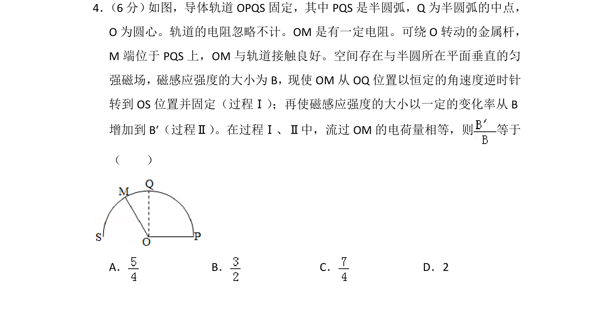
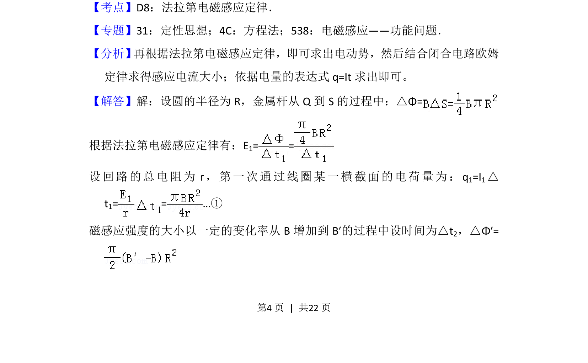
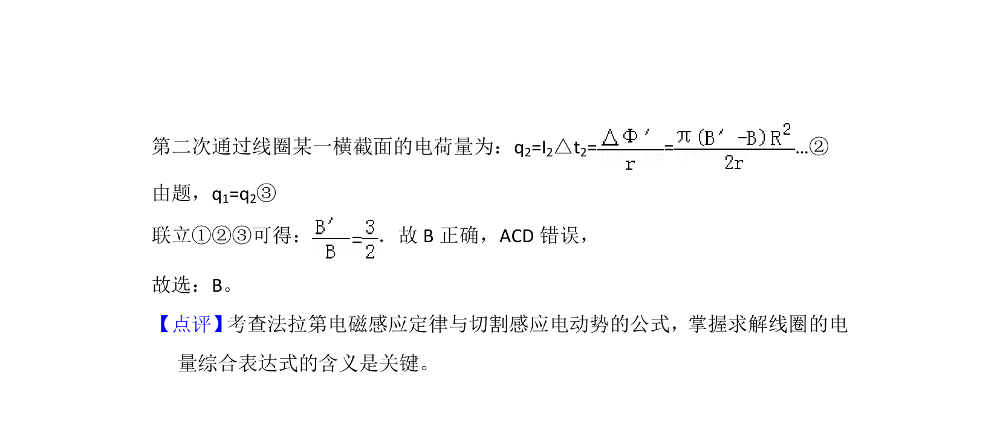

## 题面

## 摘要

导体棒旋转切割磁感线和磁场变化产生感应电动势，通过电荷量相等关系求解磁感应强度比值。

## 关联考点

- [[395-法拉第电磁感应定律|法拉第电磁感应定律]]
- [[电荷量计算]]
- [[729-转动切割|转动切割]]
- [[电磁感应中的电路问题]]

## 答案与解析

> 📄 原 PDF 第 4 页：`素材/真题/湖南/2008-2024·（湖南）物理高考真题/2018年高考物理试卷（新课标Ⅰ）（解析卷）.pdf`
