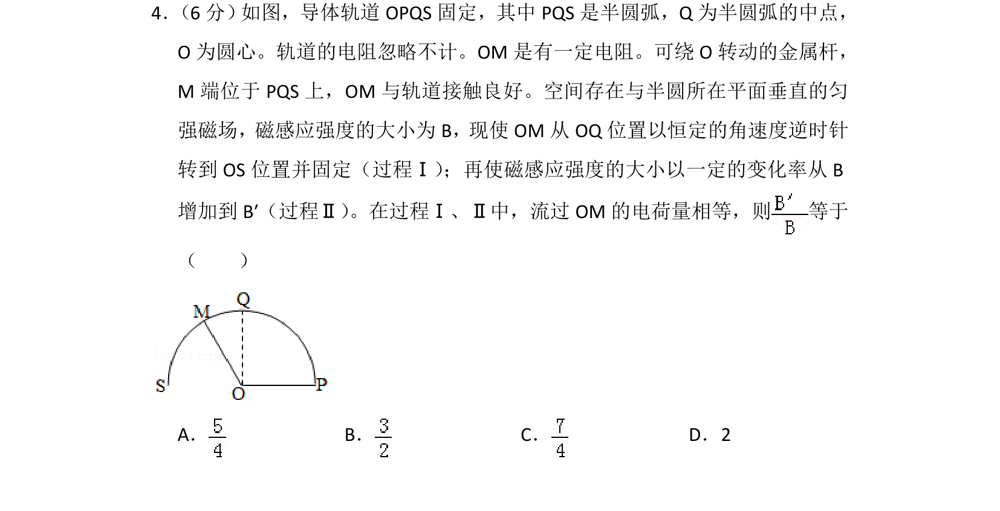
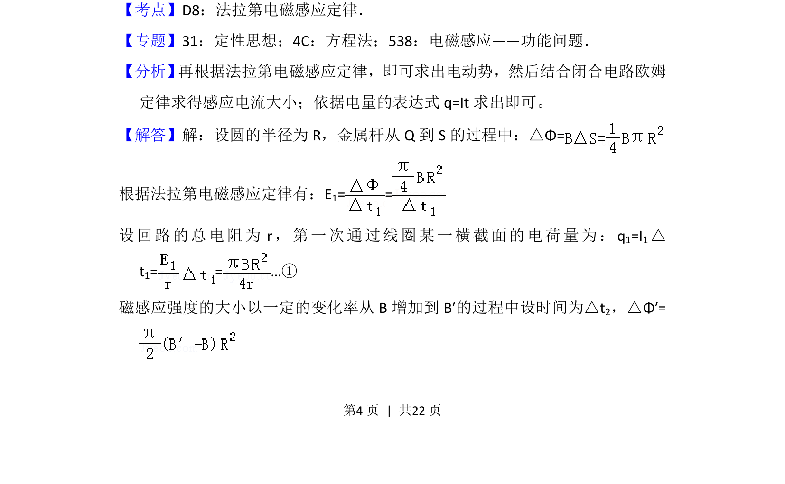
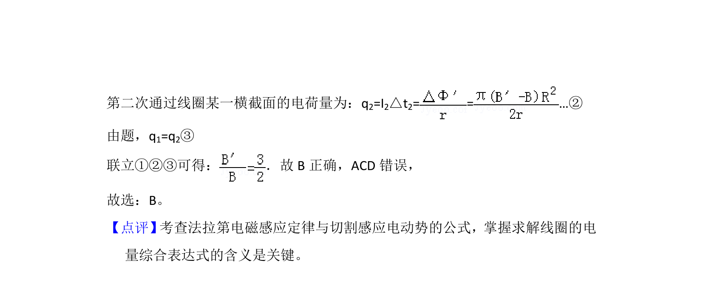

## 题面

## 摘要

导体棒旋转切割磁感线和磁场变化产生感应电动势，通过电荷量相等关系求解磁感应强度比值。

## 关联考点

- [[395-法拉第电磁感应定律|法拉第电磁感应定律]]
- [[电荷量计算]]
- [[729-转动切割|转动切割]]
- [[电磁感应中的电路问题]]

## 答案与解析

> 📄 原 PDF 第 4 页：`素材/真题/湖南/2008-2024·（湖南）物理高考真题/2018年高考物理试卷（新课标Ⅰ）（解析卷）.pdf`

<!-- 题干文本-start -->
## 题干文本
4． （6分） 如图，导体轨道OPQS固定，其中PQS是半圆弧，Q为半圆弧的中点，
O为圆心。轨道的电阻忽略不计。OM是有一定电阻。可绕O转动的金属杆，
M端位于PQS上，OM与轨道接触良好。空间存在与半圆所在平面垂直的匀
强磁场，磁感应强度的大小为B，现使OM从OQ位置以恒定的角速度逆时针
转到OS位置并固定（过程Ⅰ） ；再使磁感应强度的大小以一定的变化率从B
增加到B′（过程Ⅱ） 。在过程Ⅰ、Ⅱ中，流过OM的电荷量相等，则 等于
（　　）
A．B．C．D．2
<!-- 题干文本-end -->

<!-- 解析文本-start -->
## 解析文本
【考点】D8：法拉第电磁感应定律．菁优网版权所有
【专题】31：定性思想；4C：方程法；538：电磁感应——功能问题．
【分析】 再根据法拉第电磁感应定律，即可求出电动势，然后结合闭合电路欧姆
定律求得感应电流大小；依据电量的表达式q=It求出即可。
【解答】解：设圆的半径为R，金属杆从Q到S的过程中：△Φ=
根据法拉第电磁感应定律有：E1= =
设 回 路 的 总 电 阻 为r，第一次通过线圈某一横截面的电荷量为：q 1=I1△
t1= = …①
磁感应强度的大小以一定的变化率从B增加到B′的过程中设时间为△t 2，△Φ′=
<!-- 解析文本-end -->
