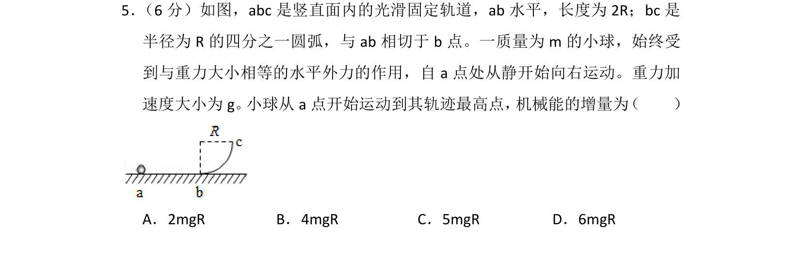
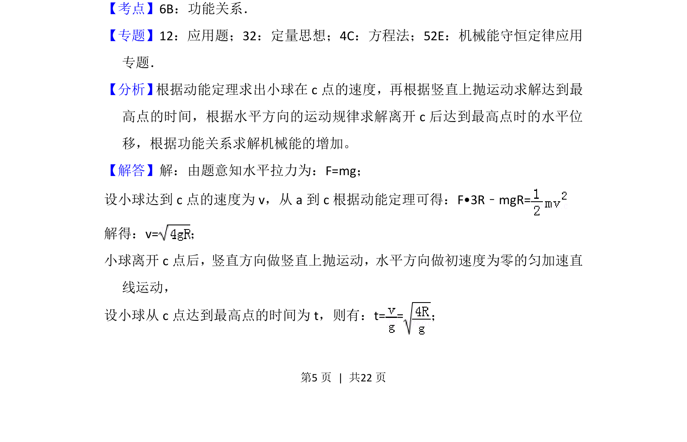
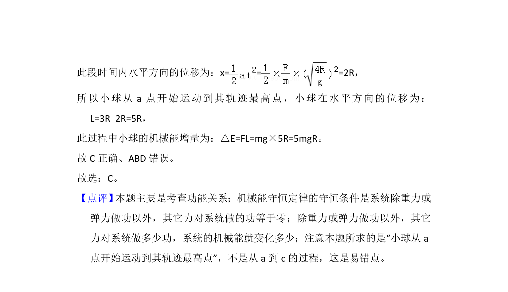

## 题面

## 摘要

小球在水平恒力和重力作用下沿光滑轨道运动，结合动能定理和竖直上抛运动求机械能增量。

## 关联考点

- [[249-功能关系|功能关系]]
- [[251-动能定理|动能定理]]
- [[706-竖直上抛运动|竖直上抛运动]]
- [[288-运动的合成与分解|运动的合成与分解]]

## 答案与解析

> 📄 原 PDF 第 5 页：`素材/真题/湖南/2008-2024·（湖南）物理高考真题/2018年高考物理试卷（新课标Ⅰ）（解析卷）.pdf`
