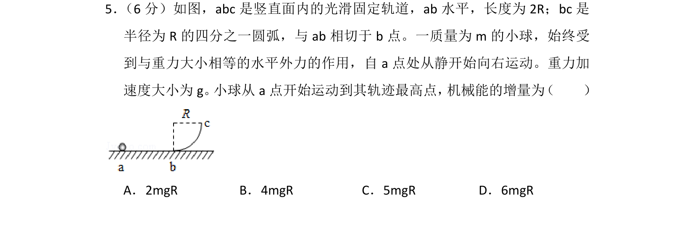
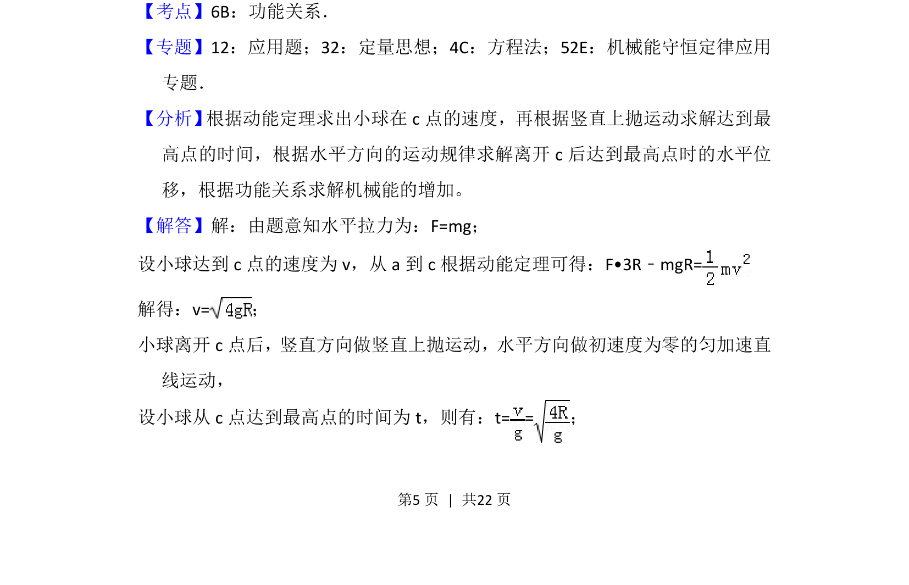
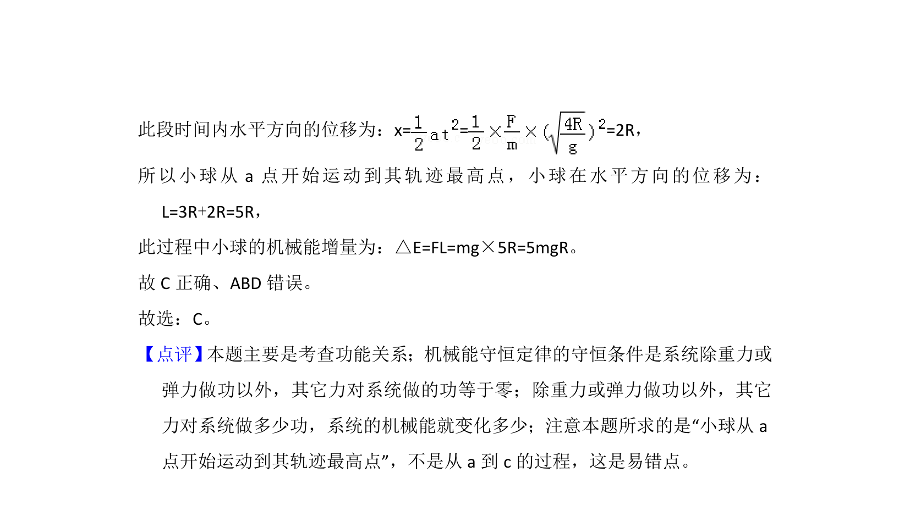

## 题面

## 摘要

小球在水平恒力和重力作用下沿光滑轨道运动，结合动能定理和竖直上抛运动求机械能增量。

## 关联考点

- [[249-功能关系|功能关系]]
- [[251-动能定理|动能定理]]
- [[706-竖直上抛运动|竖直上抛运动]]
- [[288-运动的合成与分解|运动的合成与分解]]

## 答案与解析

> 📄 原 PDF 第 5 页：`素材/真题/湖南/2008-2024·（湖南）物理高考真题/2018年高考物理试卷（新课标Ⅰ）（解析卷）.pdf`

<!-- 题干文本-start -->
## 题干文本
5． （6分）如图，abc是竖直面内的光滑固定轨道，ab水平，长度为2R；bc是
半径为R的四分之一圆弧，与ab相切于b点。一质量为m的小球，始终受
到与重力大小相等的水平外力的作用，自a点处从静开始向右运动。重力加
速度大小为g。 小球从a点开始运动到其轨迹最高点， 机械能的增量为 （　　）
A．2mgR B．4mgR C．5mgR D．6mgR
<!-- 题干文本-end -->

<!-- 解析文本-start -->
## 解析文本
【考点】6B：功能关系．菁优网版权所有
【专题】12：应用题；32：定量思想；4C：方程法；52E：机械能守恒定律应用
专题．
【分析】 根据动能定理求出小球在c点的速度，再根据竖直上抛运动求解达到最
高点的时间，根据水平方向的运动规律求解离开c后达到最高点时的水平位
移，根据功能关系求解机械能的增加。
【解答】解：由题意知水平拉力为：F=mg；
设小球达到c点的速度为v，从a到c根据动能定理可得：F•3R﹣mgR=
解得：v=；
小球离开c点后，竖直方向做竖直上抛运动，水平方向做初速度为零的匀加速直
线运动，
设小球从c点达到最高点的时间为t，则有：t= =；
<!-- 解析文本-end -->
