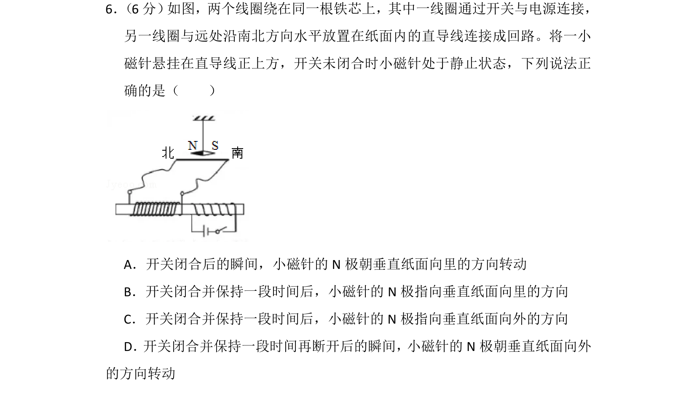
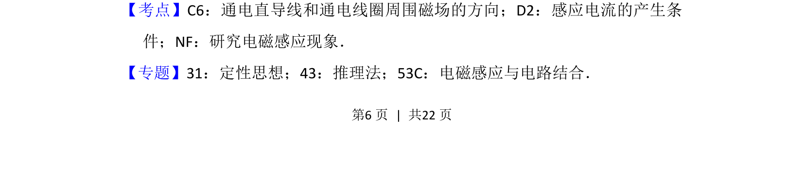
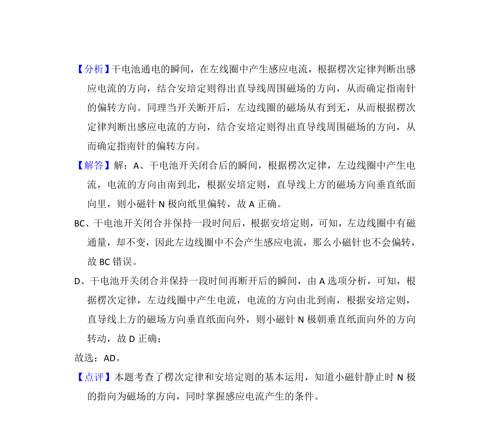

## 题面

## 摘要

考查电磁感应现象、通电直导线磁场方向判断及对小磁针的作用。

## 关联考点

- [[175-电磁感应|电磁感应]]
- [[330-通电直导线磁场|通电直导线磁场]]
- [[135-安培定则|安培定则]]
- [[393-楞次定律|楞次定律]]

## 答案与解析

> 📄 原 PDF 第 6 页：`素材/真题/湖南/2008-2024·（湖南）物理高考真题/2018年高考物理试卷（新课标Ⅰ）（解析卷）.pdf`
