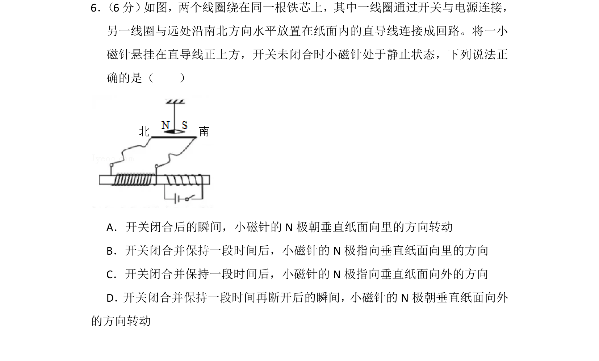
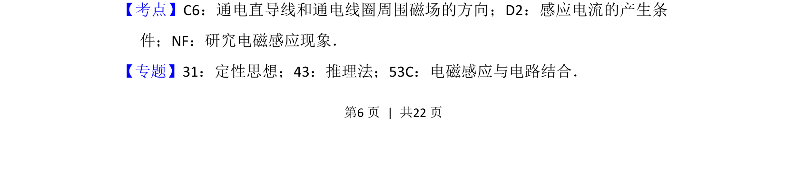
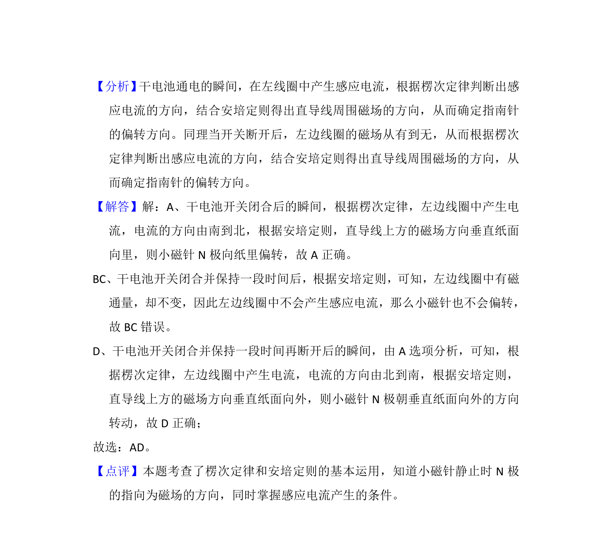

## 题面

## 摘要

考查电磁感应现象、通电直导线磁场方向判断及对小磁针的作用。

## 关联考点

- [[175-电磁感应|电磁感应]]
- [[330-通电直导线磁场|通电直导线磁场]]
- [[135-安培定则|安培定则]]
- [[393-楞次定律|楞次定律]]

## 答案与解析

> 📄 原 PDF 第 6 页：`素材/真题/湖南/2008-2024·（湖南）物理高考真题/2018年高考物理试卷（新课标Ⅰ）（解析卷）.pdf`

<!-- 题干文本-start -->
## 题干文本
6． （6分） 如图，两个线圈绕在同一根铁芯上，其中一线圈通过开关与电源连接，
另一线圈与远处沿南北方向水平放置在纸面内的直导线连接成回路。将一小
磁针悬挂在直导线正上方，开关未闭合时小磁针处于静止状态，下列说法正
确的是（　　）
A．开关闭合后的瞬间，小磁针的N极朝垂直纸面向里的方向转动
B．开关闭合并保持一段时间后，小磁针的N极指向垂直纸面向里的方向
C．开关闭合并保持一段时间后，小磁针的N极指向垂直纸面向外的方向
D．开关闭合并保持一段时间再断开后的瞬间，小磁针的N极朝垂直纸面向外
的方向转动
<!-- 题干文本-end -->

<!-- 解析文本-start -->
## 解析文本
【考点】C6：通电直导线和通电线圈周围磁场的方向；D2：感应电流的产生条
件；NF：研究电磁感应现象．菁优网版权所有
【专题】31：定性思想；43：推理法；53C：电磁感应与电路结合．
<!-- 解析文本-end -->
