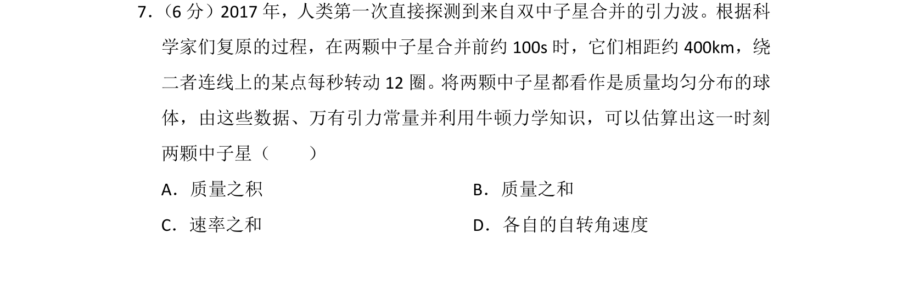
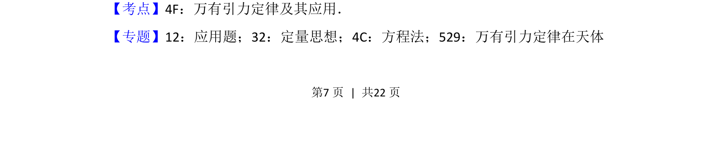
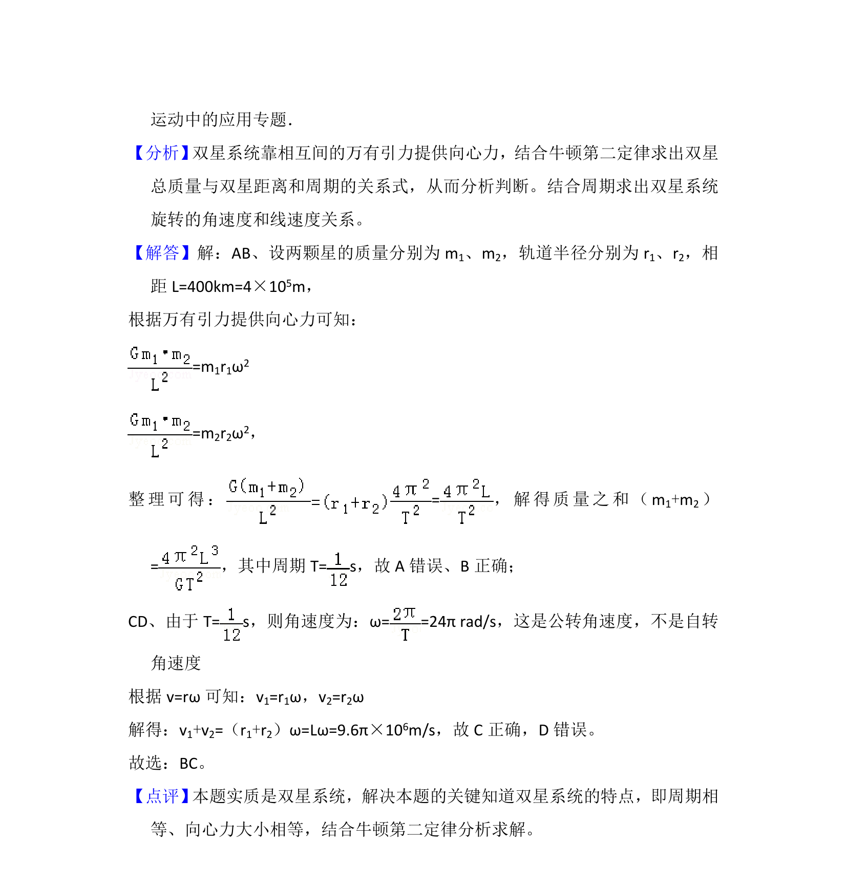

## 题面

## 摘要

两颗中子星构成双星系统，根据引力波及轨道数据结合万有引力定律估算质量之和与速率之和。

## 关联考点

- [[246-万有引力定律|万有引力定律]]
- [[双星模型]]
- [[256-向心力|向心力]]

## 答案与解析

> 📄 原 PDF 第 7 页：`素材/真题/湖南/2008-2024·（湖南）物理高考真题/2018年高考物理试卷（新课标Ⅰ）（解析卷）.pdf`
