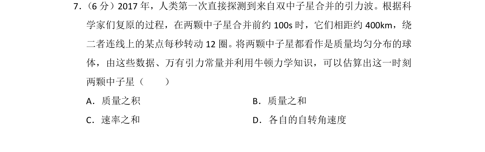
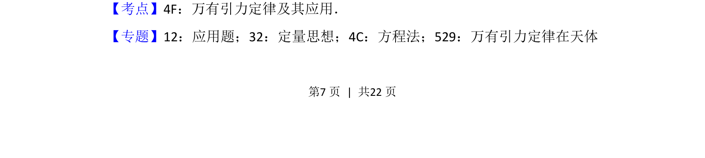
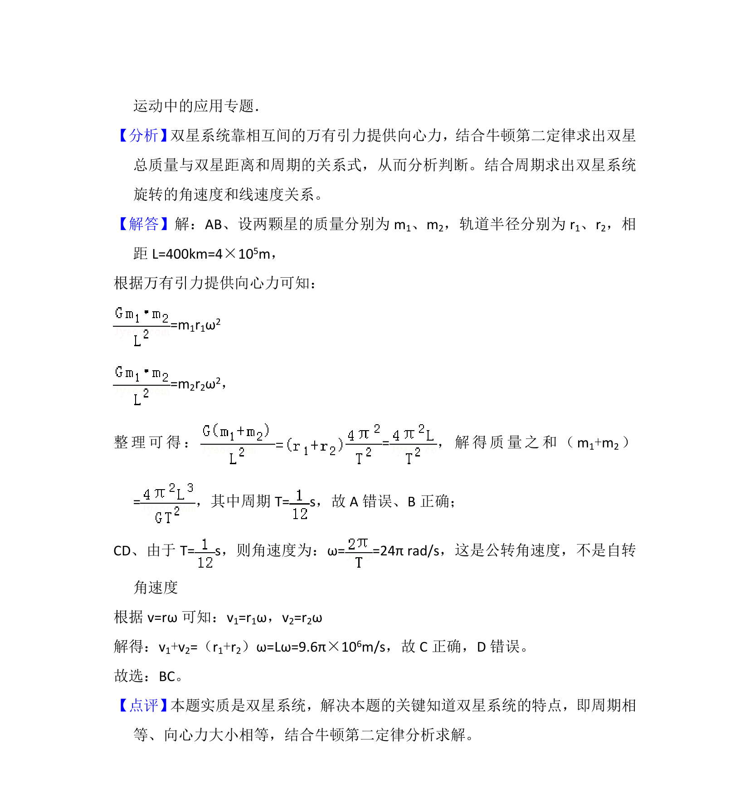

## 题面

## 摘要

两颗中子星构成双星系统，根据引力波及轨道数据结合万有引力定律估算质量之和与速率之和。

## 关联考点

- [[246-万有引力定律|万有引力定律]]
- [[双星模型]]
- [[256-向心力|向心力]]

## 答案与解析

> 📄 原 PDF 第 7 页：`素材/真题/湖南/2008-2024·（湖南）物理高考真题/2018年高考物理试卷（新课标Ⅰ）（解析卷）.pdf`

<!-- 题干文本-start -->
## 题干文本
7． （6分）2017年，人类第一次直接探测到来自双中子星合并的引力波。根据科
学家们复原的过程，在两颗中子星合并前约100s时，它们相距约400km，绕
二者连线上的某点每秒转动12圈。将两颗中子星都看作是质量均匀分布的球
体，由这些数据、万有引力常量并利用牛顿力学知识，可以估算出这一时刻
两颗中子星（　　）
A．质量之积B．质量之和
C．速率之和D．各自的自转角速度
<!-- 题干文本-end -->

<!-- 解析文本-start -->
## 解析文本
【考点】4F：万有引力定律及其应用．菁优网版权所有
【专题】12：应用题；32：定量思想；4C：方程法；529：万有引力定律在天体
<!-- 解析文本-end -->
