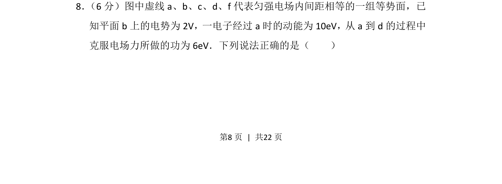
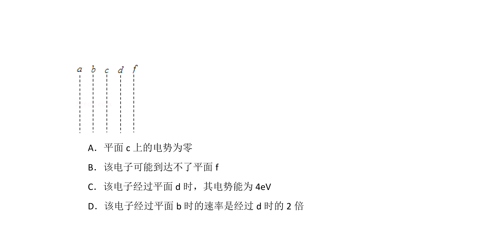
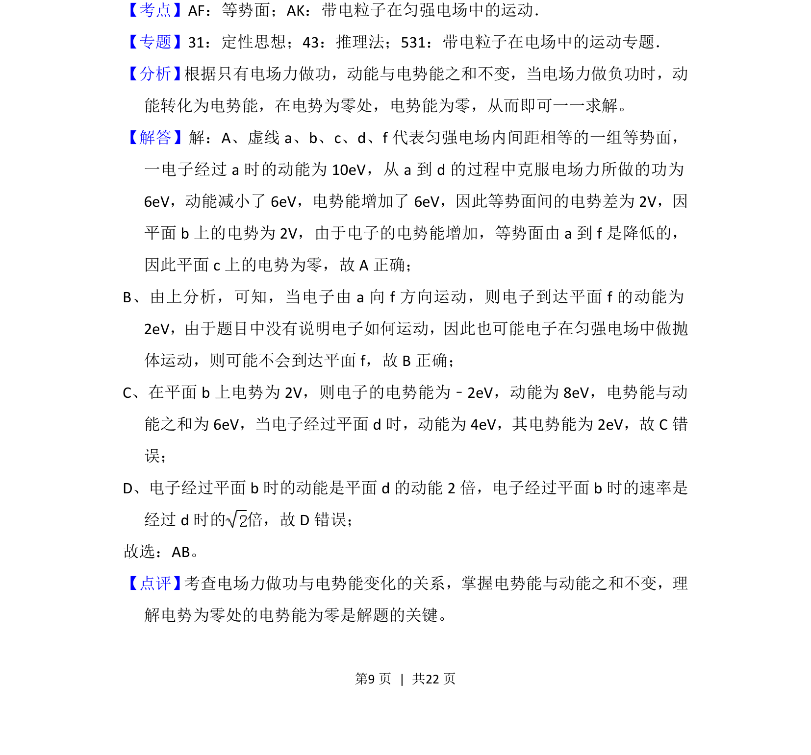
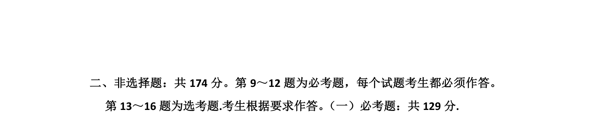

## 题面

## 摘要

电子在匀强电场等势面间运动，根据电场力做功与动能变化关系分析电势、电势能相关问题。

## 关联考点

- [[673-电场力做功|电场力做功]]
- [[282-等势面|等势面]]
- [[251-动能定理|动能定理]]

## 答案与解析

> 📄 原 PDF 第 8 页：`素材/真题/湖南/2008-2024·（湖南）物理高考真题/2018年高考物理试卷（新课标Ⅰ）（解析卷）.pdf`
