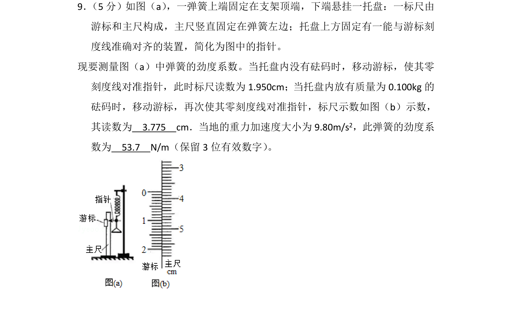
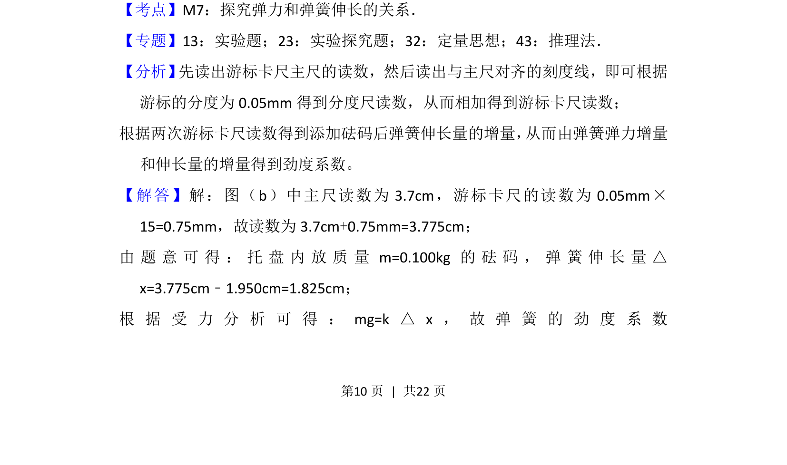
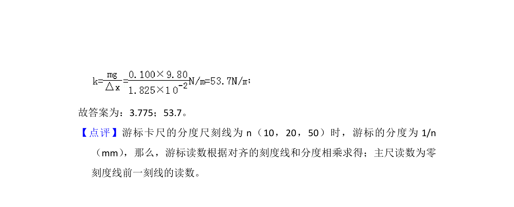

## 题面

## 摘要

实验通过游标卡尺测量弹簧伸长量，利用胡克定律计算劲度系数。

## 关联考点

- [[615-探究弹力和弹簧伸长的关系|探究弹力和弹簧伸长的关系]]
- [[848-游标卡尺读数|游标卡尺读数]]
- [[233-胡克定律|胡克定律]]
- [[540-劲度系数|劲度系数]]

## 答案与解析

> 📄 原 PDF 第 10 页：`素材/真题/湖南/2008-2024·（湖南）物理高考真题/2018年高考物理试卷（新课标Ⅰ）（解析卷）.pdf`
