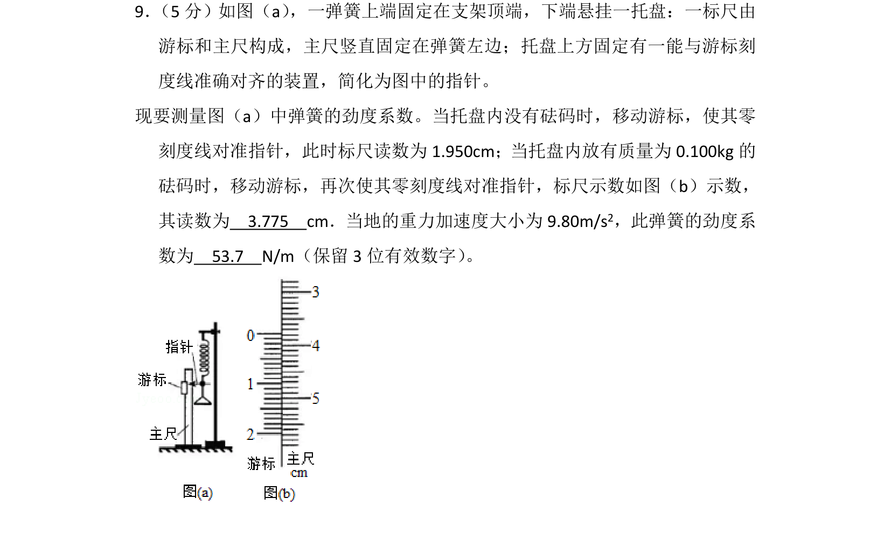
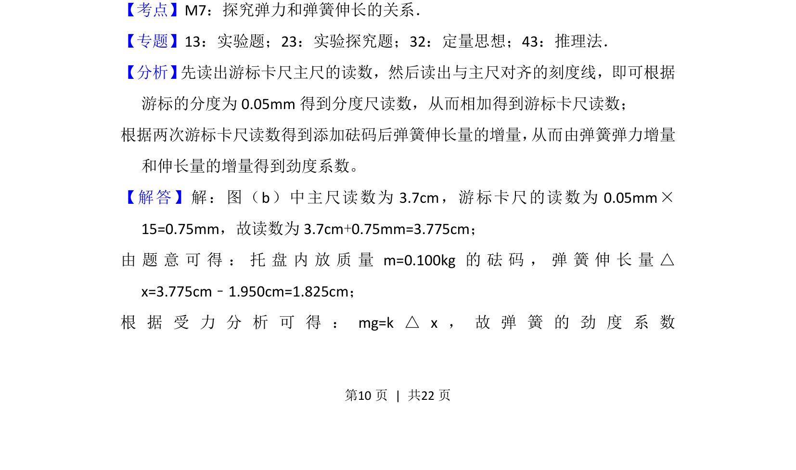
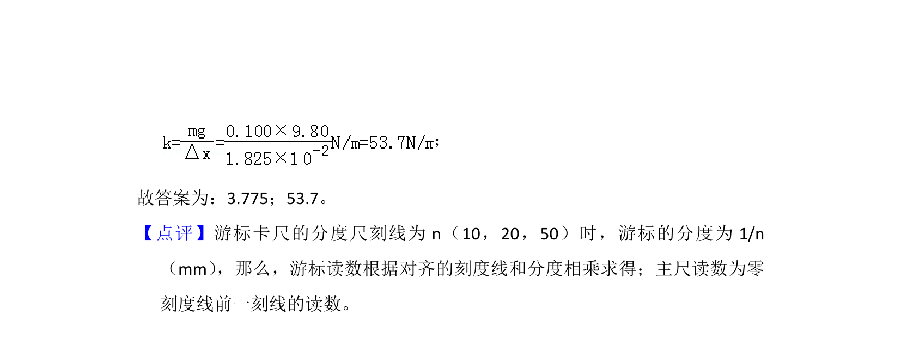

## 题面

## 摘要

实验通过游标卡尺测量弹簧伸长量，利用胡克定律计算劲度系数。

## 关联考点

- [[615-探究弹力和弹簧伸长的关系|探究弹力和弹簧伸长的关系]]
- [[848-游标卡尺读数|游标卡尺读数]]
- [[233-胡克定律|胡克定律]]
- [[540-劲度系数|劲度系数]]

## 答案与解析

> 📄 原 PDF 第 10 页：`素材/真题/湖南/2008-2024·（湖南）物理高考真题/2018年高考物理试卷（新课标Ⅰ）（解析卷）.pdf`

<!-- 题干文本-start -->
## 题干文本
9． （5分）如图（a） ，一弹簧上端固定在支架顶端，下端悬挂一托盘：一标尺由
游标和主尺构成，主尺竖直固定在弹簧左边；托盘上方固定有一能与游标刻
度线准确对齐的装置，简化为图中的指针。
现要测量图（a）中弹簧的劲度系数。当托盘内没有砝码时，移动游标，使其零
刻度线对准指针，此时标尺读数为1.950cm；当托盘内放有质量为0.100kg的
砝码时，移动游标，再次使其零刻度线对准指针，标尺示数如图（b）示数，
其读数为　3.775　cm．当地的重力加速度大小为9.80m/s 2，此弹簧的劲度系
数为　53.7　N/m（保留3位有效数字） 。
<!-- 题干文本-end -->

<!-- 解析文本-start -->
## 解析文本
【考点】M7：探究弹力和弹簧伸长的关系．菁优网版权所有
【专题】13：实验题；23：实验探究题；32：定量思想；43：推理法．
【分析】 先读出游标卡尺主尺的读数，然后读出与主尺对齐的刻度线，即可根据
游标的分度为0.05mm得到分度尺读数，从而相加得到游标卡尺读数；
根据两次游标卡尺读数得到添加砝码后弹簧伸长量的增量， 从而由弹簧弹力增量
和伸长量的增量得到劲度系数。
【解答】解：图（b）中主尺读数为3.7cm，游标卡尺的读数为0.05mm×
15=0.75mm，故读数为3.7cm+0.75mm=3.775cm；
由 题 意 可 得 ： 托 盘 内 放 质 量m=0.100kg的 砝 码 ， 弹 簧 伸 长 量 △
x=3.775cm﹣1.950cm=1.825cm；
根 据 受 力 分 析 可 得 ：mg=k△x， 故 弹 簧 的 劲 度 系 数
<!-- 解析文本-end -->
