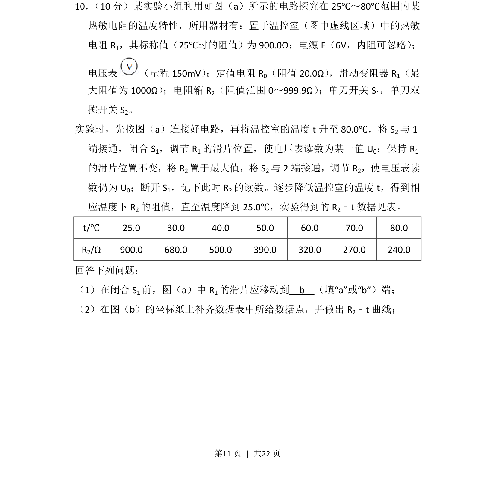
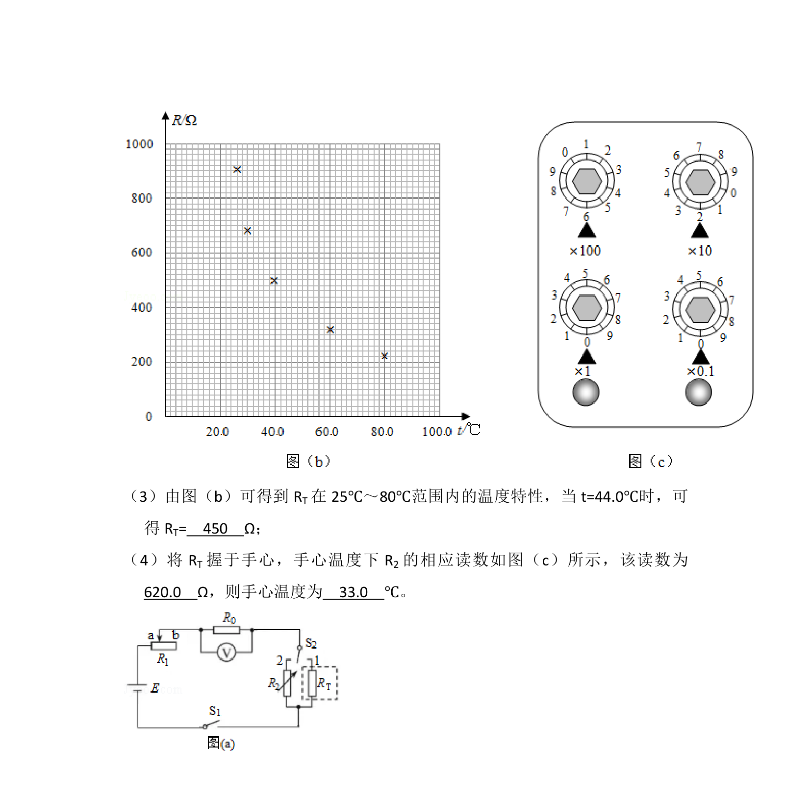
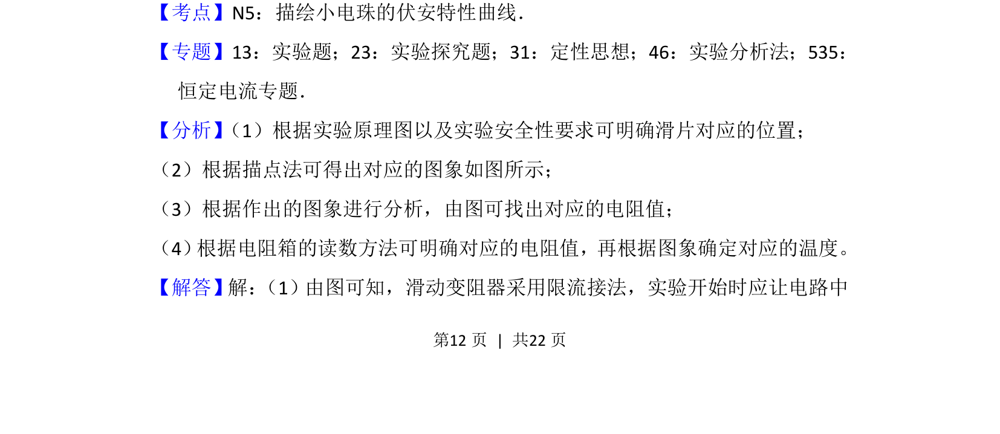
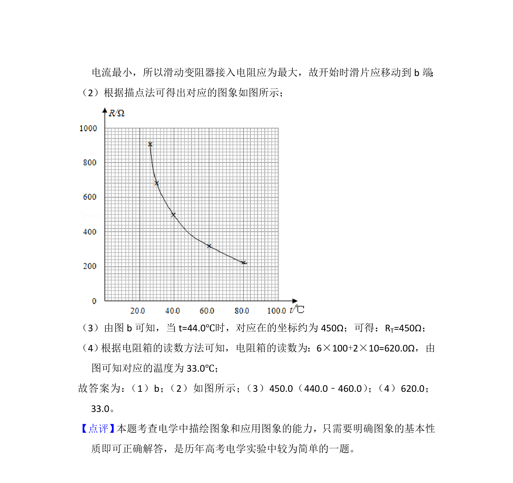

## 题面

## 摘要

探究热敏电阻温度特性，用替代法测量不同温度下阻值并描点作图。

## 关联考点

- [[替代法测电阻]]
- [[热敏电阻]]
- [[582-实验数据处理|实验数据处理]]
- [[电路调节]]

## 答案与解析

> 📄 原 PDF 第 11 页：`素材/真题/湖南/2008-2024·（湖南）物理高考真题/2018年高考物理试卷（新课标Ⅰ）（解析卷）.pdf`
