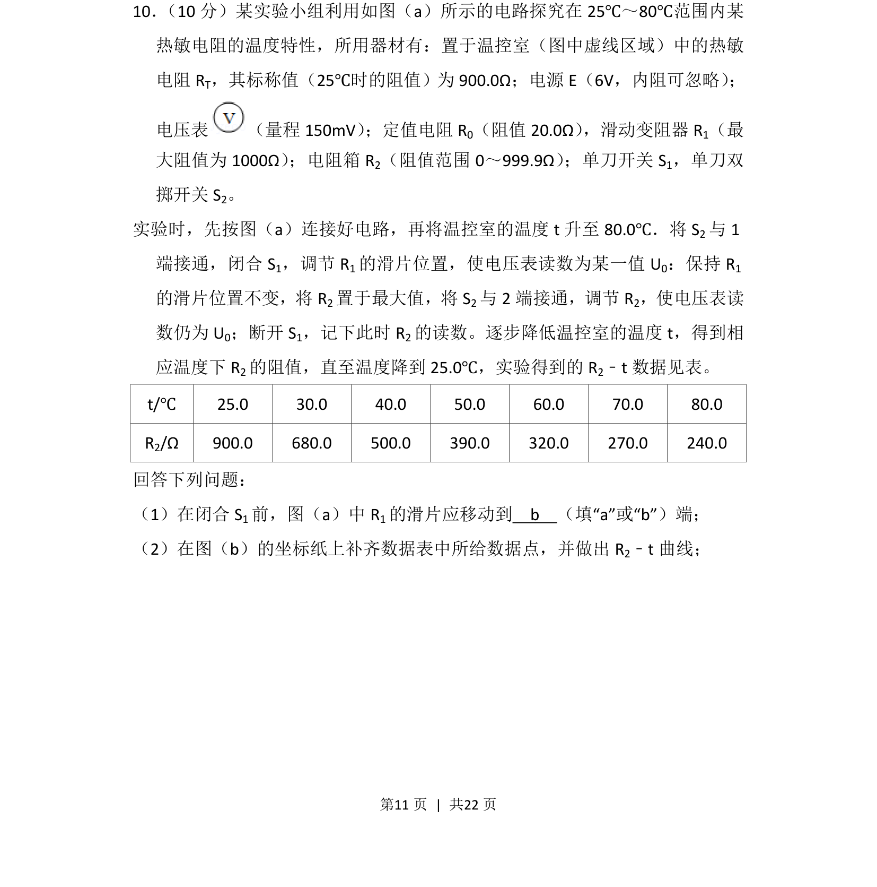
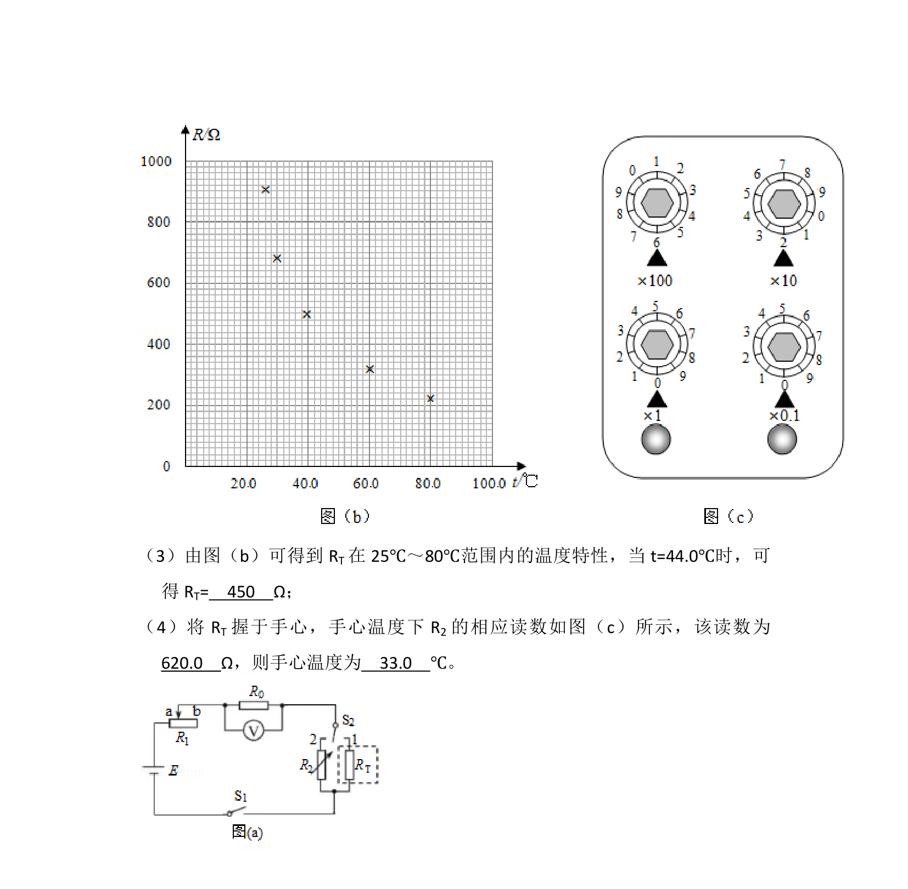
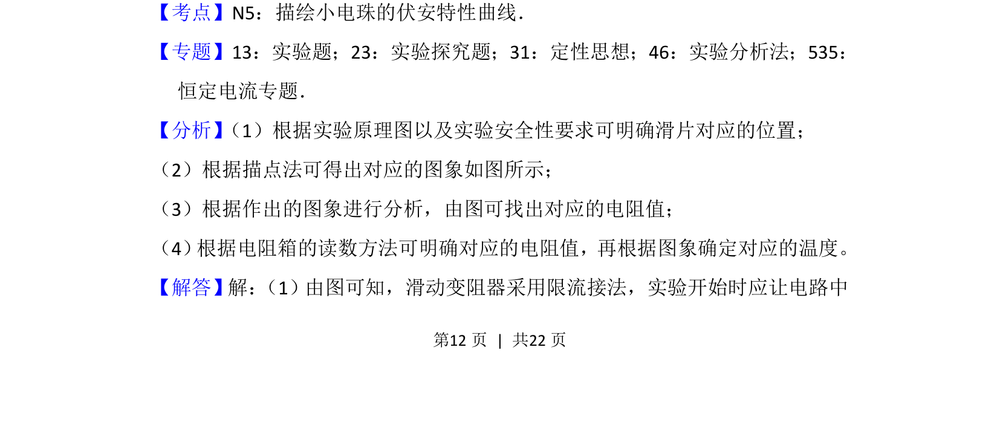
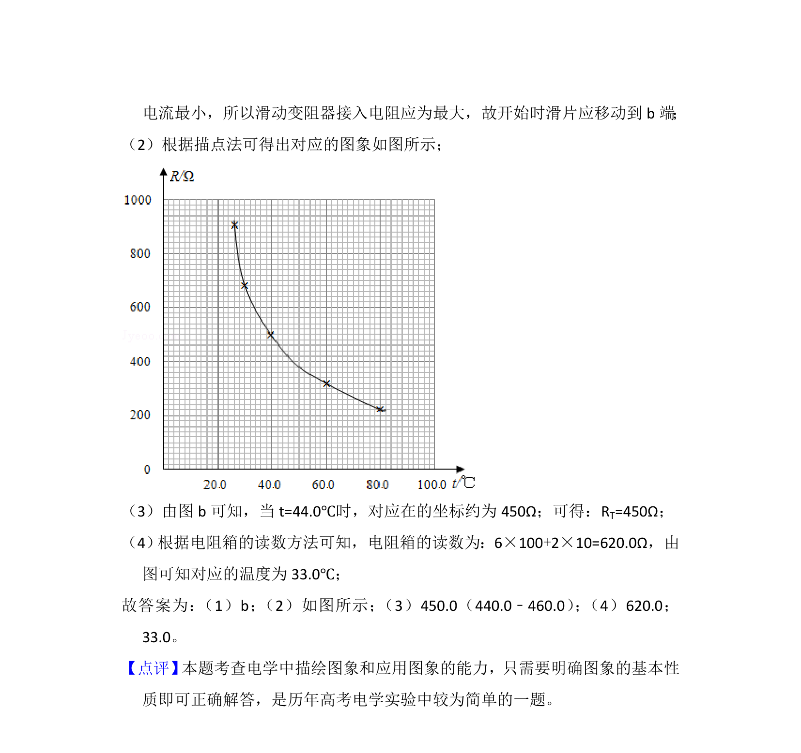

## 题面

## 摘要

探究热敏电阻温度特性，用替代法测量不同温度下阻值并描点作图。

## 关联考点

- [[替代法测电阻]]
- [[热敏电阻]]
- [[582-实验数据处理|实验数据处理]]
- [[电路调节]]

## 答案与解析

> 📄 原 PDF 第 11 页：`素材/真题/湖南/2008-2024·（湖南）物理高考真题/2018年高考物理试卷（新课标Ⅰ）（解析卷）.pdf`

<!-- 题干文本-start -->
## 题干文本
10． （10分）某实验小组利用如图（a）所示的电路探究在25℃～80℃范围内某
热敏电阻的温度特性，所用器材有：置于温控室（图中虚线区域）中的热敏
电阻R T，其标称值（25℃时的阻值）为900.0Ω；电源E（6V，内阻可忽略） ；
电压表 （量程150mV） ；定值电阻R 0（阻值20.0Ω） ，滑动变阻器R1（最
大阻值为1000Ω） ；电阻箱R2（阻值范围0～999.9Ω） ；单刀开关S1，单刀双
掷开关S 2。
实验时，先按图（a）连接好电路，再将温控室的温度t升至80.0℃．将S 2与1
端接通，闭合S 1，调节R 1的滑片位置，使电压表读数为某一值U 0：保持R 1
的滑片位置不变，将R 2置于最大值，将S 2与2端接通，调节R 2，使电压表读
数仍为U 0；断开S 1，记下此时R 2的读数。逐步降低温控室的温度t，得到相
应温度下R 2的阻值，直至温度降到25.0℃，实验得到的R 2﹣t数据见表。
t/℃ 25.0 30.0 40.0 50.0 60.0 70.0 80.0
R2/Ω 900.0 680.0 500.0 390.0 320.0 270.0 240.0
回答下列问题：
（1）在闭合S 1前，图（a）中R 1的滑片应移动到　b　（填“a”或“b”）端；
（2）在图（b）的坐标纸上补齐数据表中所给数据点，并做出R 2﹣t曲线；
<!-- 题干文本-end -->

<!-- 解析文本-start -->
## 解析文本

<!-- 解析文本-end -->
