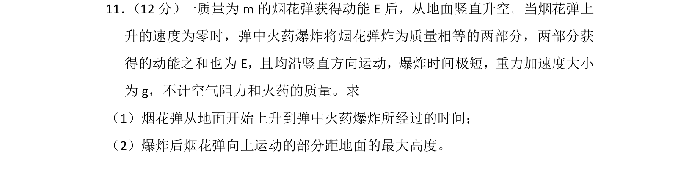
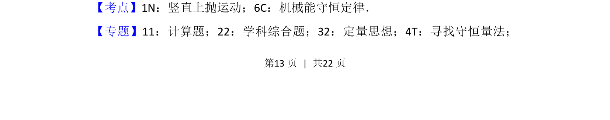
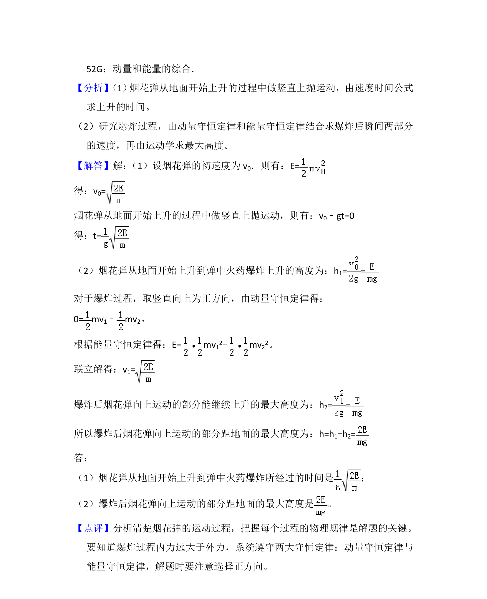

## 题面

## 摘要

烟花弹竖直上抛至最高点爆炸，结合竖直上抛运动、机械能守恒和爆炸模型求时间与高度。

## 关联考点

- [[706-竖直上抛运动|竖直上抛运动]]
- [[085-机械能守恒-初中|机械能守恒定律]]
- [[347-动量守恒定律|动量守恒定律]]

## 答案与解析

> 📄 原 PDF 第 13 页：`素材/真题/湖南/2008-2024·（湖南）物理高考真题/2018年高考物理试卷（新课标Ⅰ）（解析卷）.pdf`
