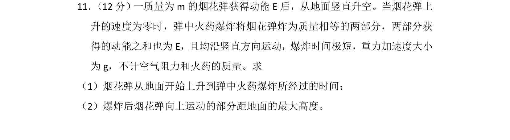
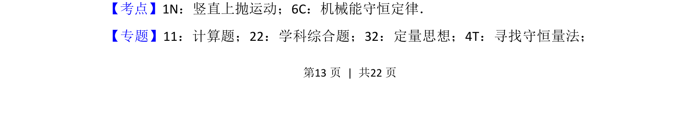
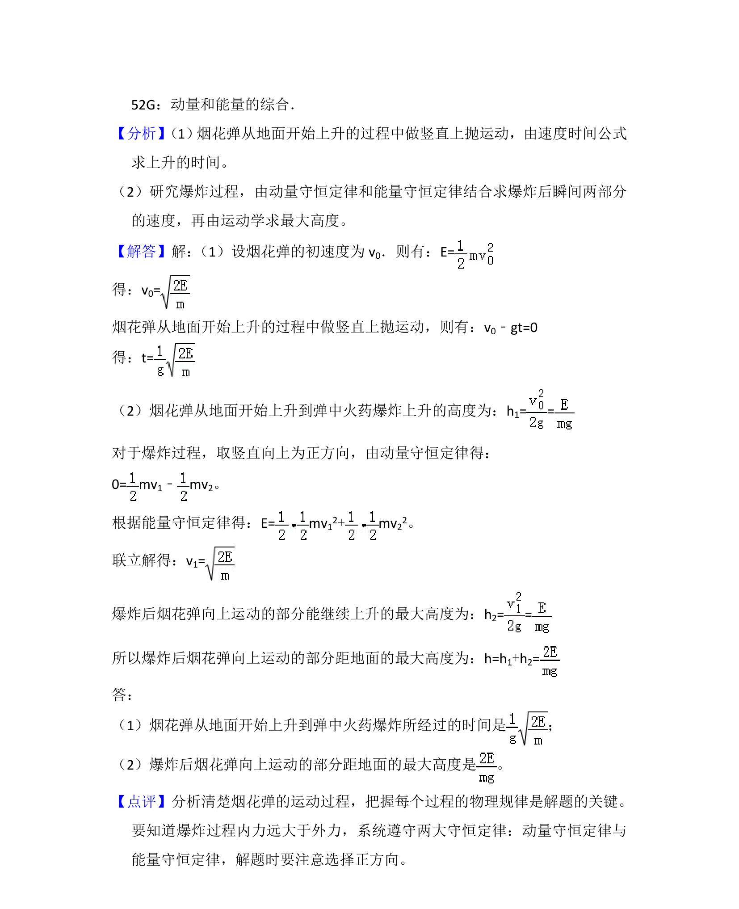

## 题面

## 摘要

烟花弹竖直上抛至最高点爆炸，结合竖直上抛运动、机械能守恒和爆炸模型求时间与高度。

## 关联考点

- [[706-竖直上抛运动|竖直上抛运动]]
- [[085-机械能守恒-初中|机械能守恒定律]]
- [[347-动量守恒定律|动量守恒定律]]

## 答案与解析

> 📄 原 PDF 第 13 页：`素材/真题/湖南/2008-2024·（湖南）物理高考真题/2018年高考物理试卷（新课标Ⅰ）（解析卷）.pdf`

<!-- 题干文本-start -->
## 题干文本
11． （12分） 一质量为m的烟花弹获得动能E后，从地面竖直升空。当烟花弹上
升的速度为零时，弹中火药爆炸将烟花弹炸为质量相等的两部分，两部分获
得的动能之和也为E，且均沿竖直方向运动，爆炸时间极短，重力加速度大小
为g，不计空气阻力和火药的质量。求
（1）烟花弹从地面开始上升到弹中火药爆炸所经过的时间；
（2）爆炸后烟花弹向上运动的部分距地面的最大高度。
<!-- 题干文本-end -->

<!-- 解析文本-start -->
## 解析文本
【考点】1N：竖直上抛运动；6C：机械能守恒定律．菁优网版权所有
【专题】11：计算题；22：学科综合题；32：定量思想；4T：寻找守恒量法；
<!-- 解析文本-end -->
