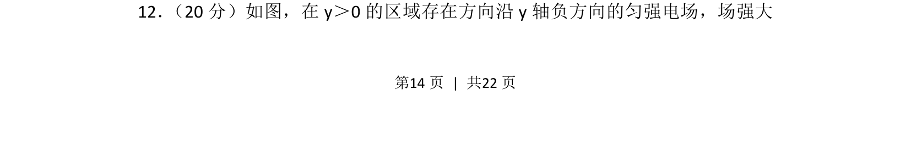
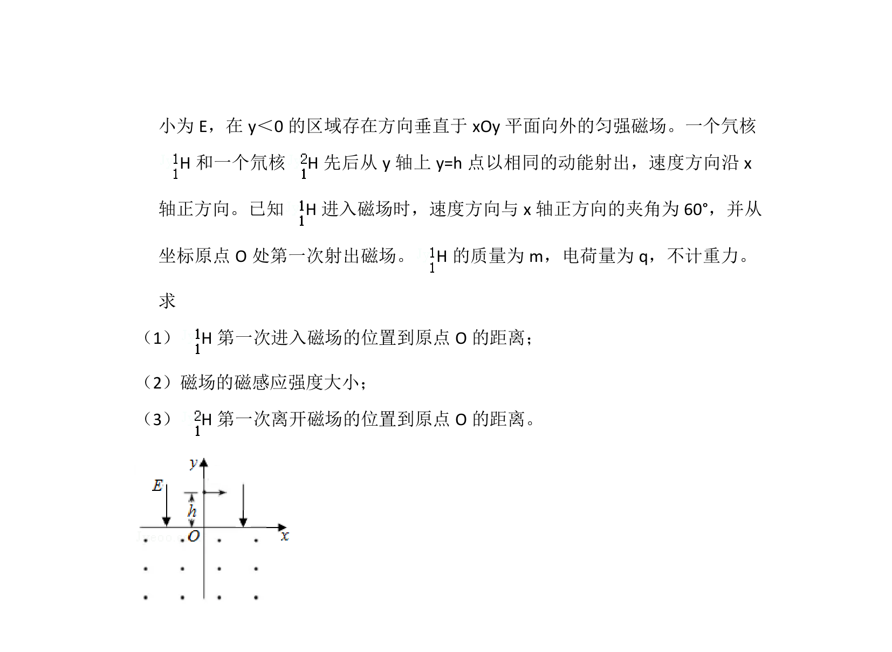
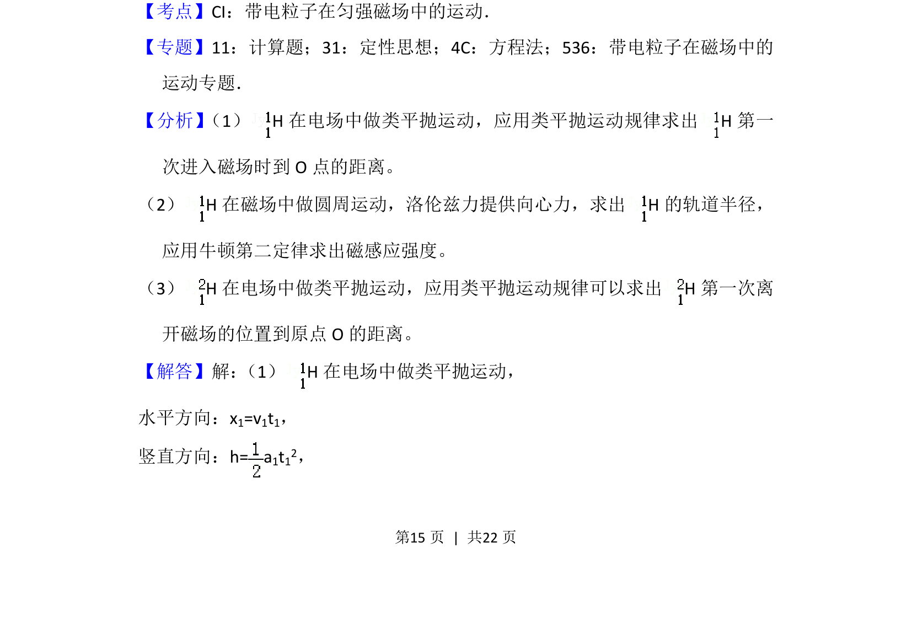
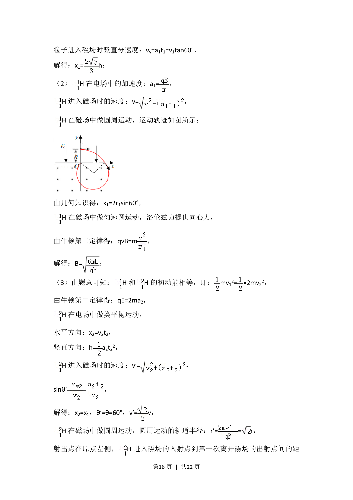
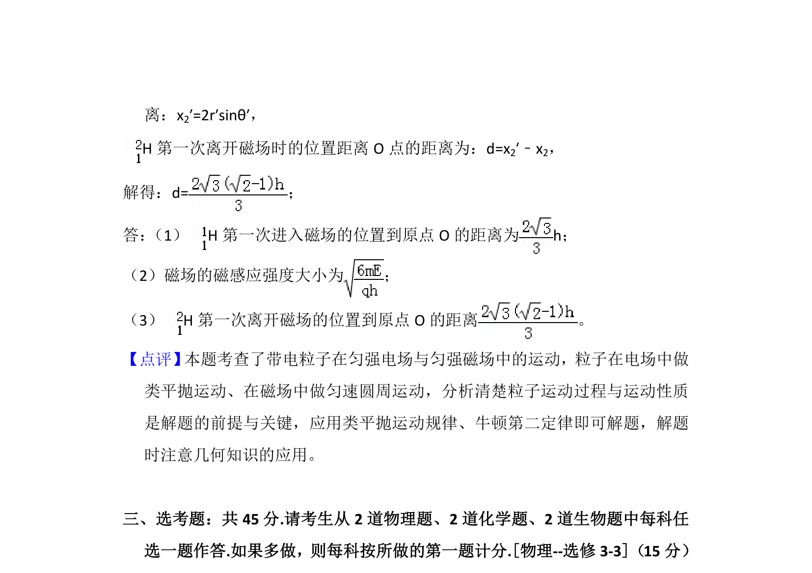

## 题面

## 摘要

带电粒子在匀强电场中做类平抛运动，分析其偏转规律及能量变化

## 关联考点

- [[252-匀强电场|匀强电场]]
- [[488-类平抛运动|类平抛运动]]
- [[带电粒子偏转]]
- [[673-电场力做功|电场力做功]]

## 答案与解析

> 📄 原 PDF 第 14 页：`素材/真题/湖南/2008-2024·（湖南）物理高考真题/2018年高考物理试卷（新课标Ⅰ）（解析卷）.pdf`
