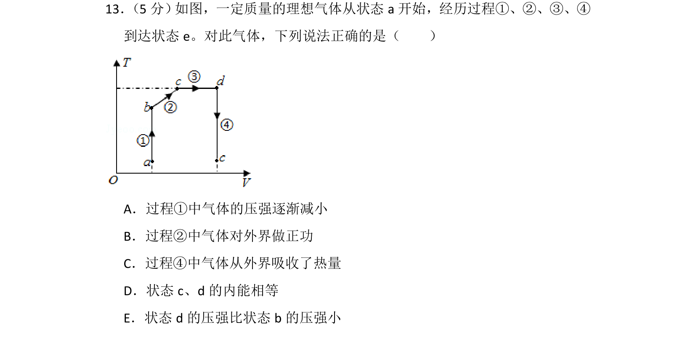
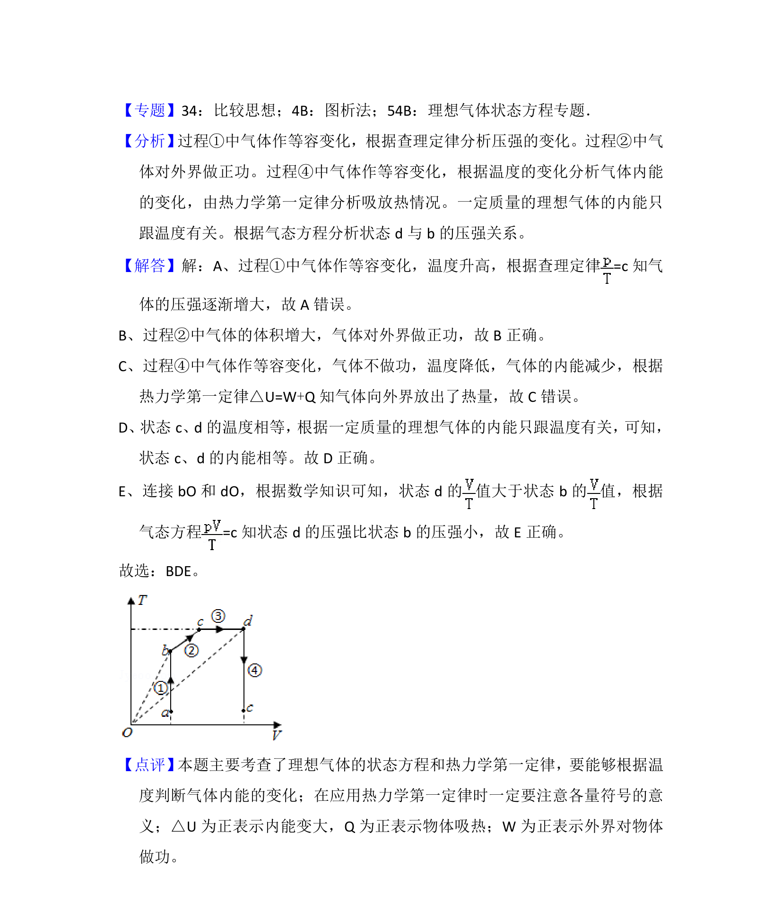

## 题面

## 摘要

通过理想气体的多过程变化，考查热力学第一定律及气体状态方程的应用。

## 关联考点

- [[440-热力学第一定律|热力学第一定律]]
- [[483-理想气体的状态方程|理想气体的状态方程]]

## 答案与解析

> 📄 原 PDF 第 17 页：`素材/真题/湖南/2008-2024·（湖南）物理高考真题/2018年高考物理试卷（新课标Ⅰ）（解析卷）.pdf`
