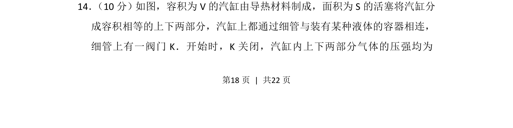
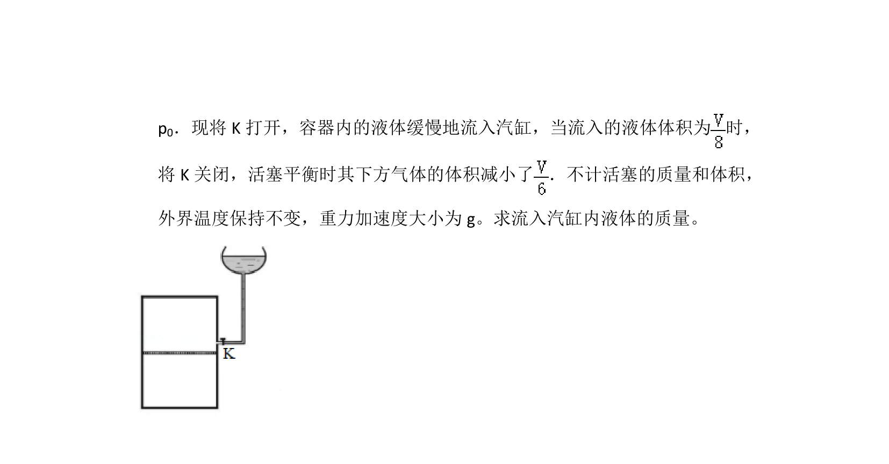
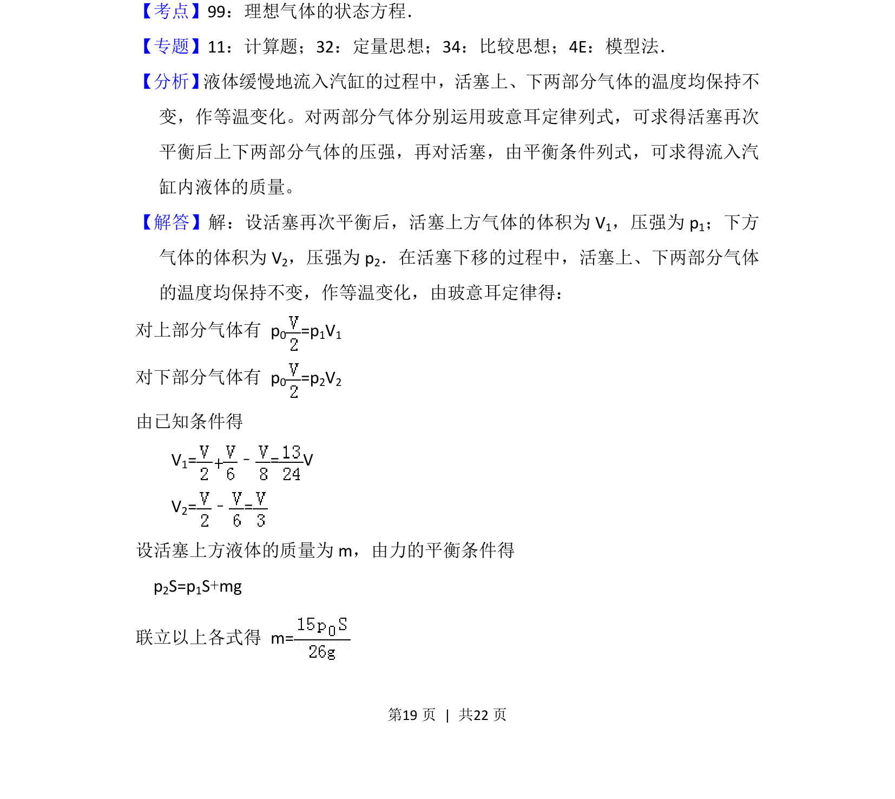
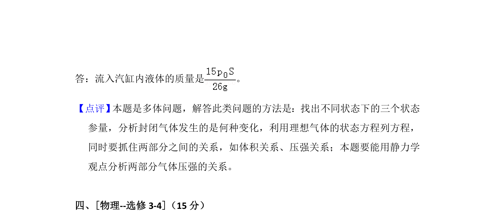

## 题面

## 摘要

探究导热汽缸中两部分气体在阀门开启前后的压强与体积变化关系。

## 关联考点

- [[446-理想气体状态方程|理想气体状态方程]]
- [[444-玻意耳定律|玻意耳定律]]
- [[550-压强计算|压强计算]]
- [[热力学平衡]]

## 答案与解析

> 📄 原 PDF 第 18 页：`素材/真题/湖南/2008-2024·（湖南）物理高考真题/2018年高考物理试卷（新课标Ⅰ）（解析卷）.pdf`
