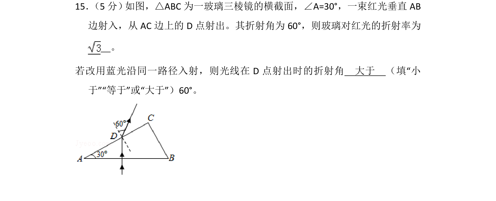
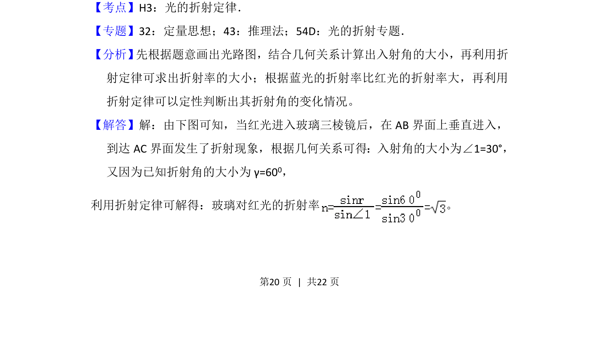
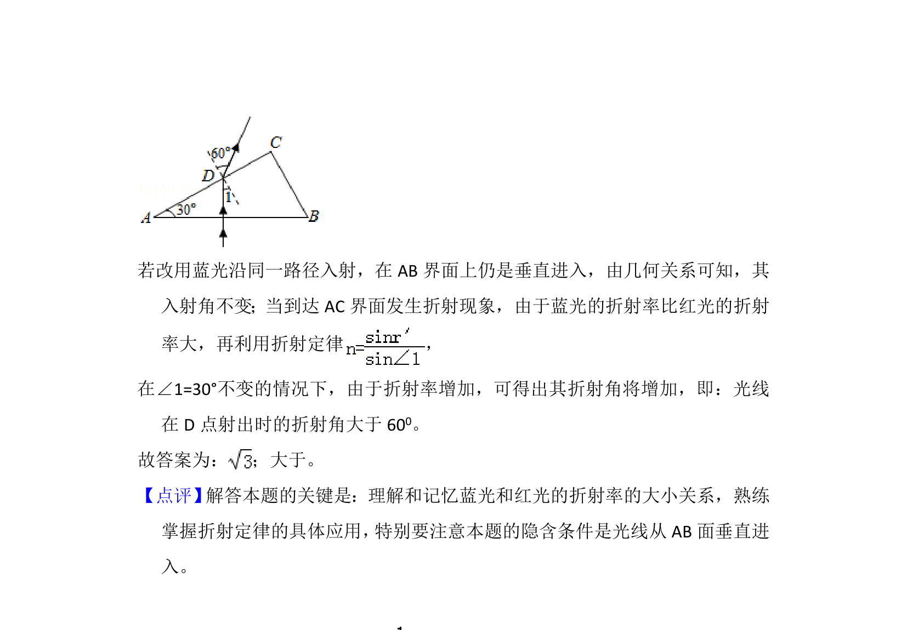

## 题面

## 摘要

红光垂直入射三棱镜，利用折射定律求折射率，并比较蓝光折射角变化。

## 关联考点

- [[520-光的折射定律|光的折射定律]]
- [[360-折射率|折射率]]
- [[005-光的色散|光的色散]]

## 答案与解析

> 📄 原 PDF 第 20 页：`素材/真题/湖南/2008-2024·（湖南）物理高考真题/2018年高考物理试卷（新课标Ⅰ）（解析卷）.pdf`
