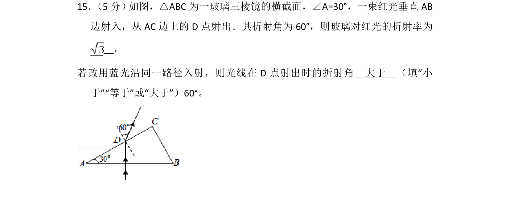
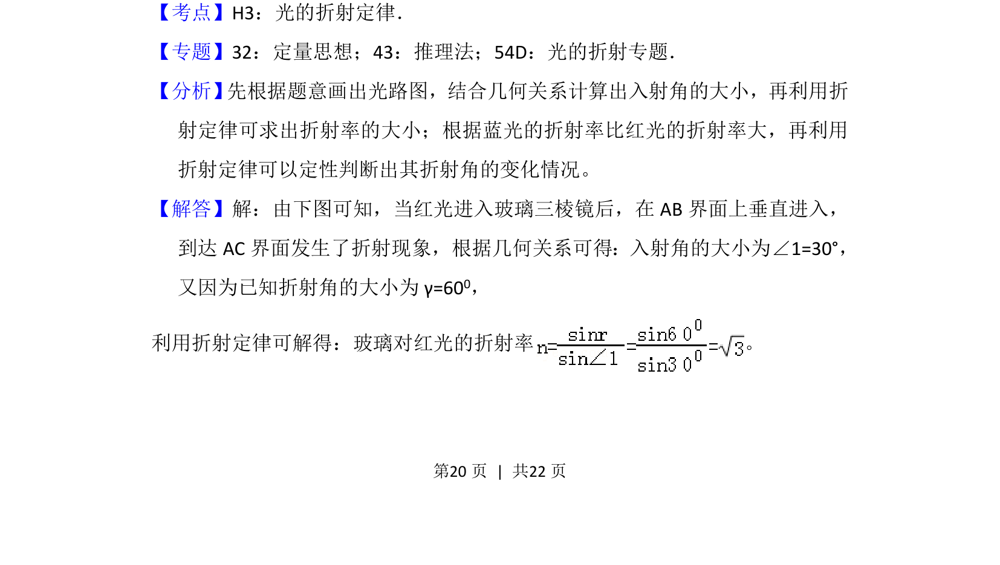
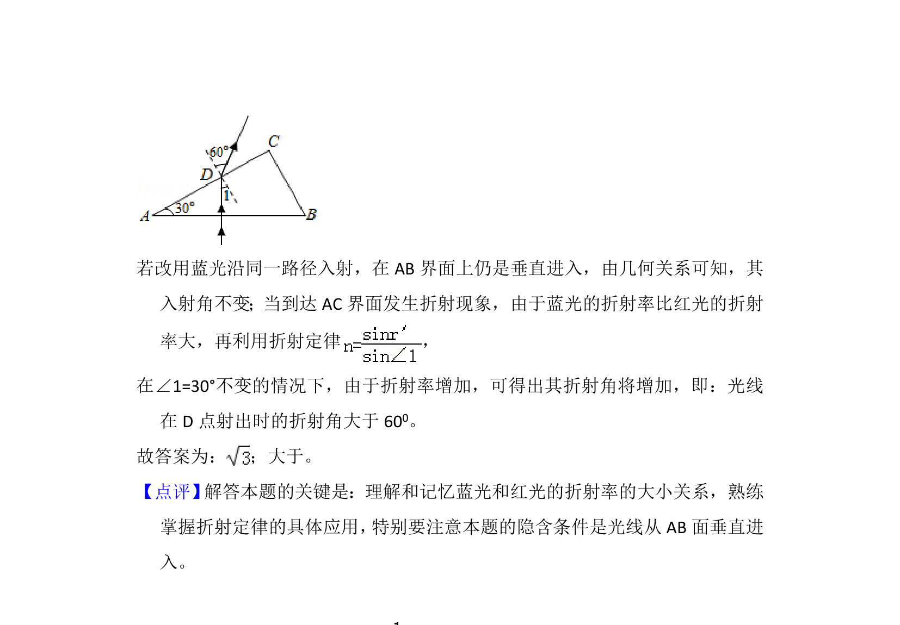

## 题面

## 摘要

红光垂直入射三棱镜，利用折射定律求折射率，并比较蓝光折射角变化。

## 关联考点

- [[520-光的折射定律|光的折射定律]]
- [[360-折射率|折射率]]
- [[005-光的色散|光的色散]]

## 答案与解析

> 📄 原 PDF 第 20 页：`素材/真题/湖南/2008-2024·（湖南）物理高考真题/2018年高考物理试卷（新课标Ⅰ）（解析卷）.pdf`

<!-- 题干文本-start -->
## 题干文本
15． （5分） 如图，△ABC为一玻璃三棱镜的横截面，∠A=30°，一束红光垂直AB
边射入，从AC边上的D点射出。其折射角为60°，则玻璃对红光的折射率为　
　。
若改用蓝光沿同一路径入射，则光线在D点射出时的折射角　大于　（填“小
于”“等于”或“大于”）60°。
<!-- 题干文本-end -->

<!-- 解析文本-start -->
## 解析文本
【考点】H3：光的折射定律．菁优网版权所有
【专题】32：定量思想；43：推理法；54D：光的折射专题．
【分析】 先根据题意画出光路图，结合几何关系计算出入射角的大小，再利用折
射定律可求出折射率的大小；根据蓝光的折射率比红光的折射率大，再利用
折射定律可以定性判断出其折射角的变化情况。
【解答】解：由下图可知，当红光进入玻璃三棱镜后，在AB界面上垂直进入，
到达AC界面发生了折射现象，根据几何关系可得：入射角的大小为∠1=30°，
又因为已知折射角的大小为γ=60 0，
利用折射定律可解得：玻璃对红光的折射率 。
<!-- 解析文本-end -->
