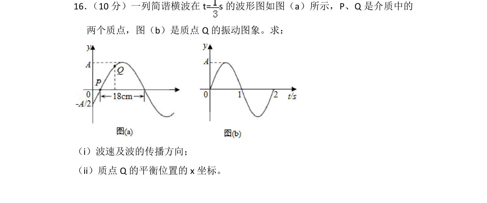
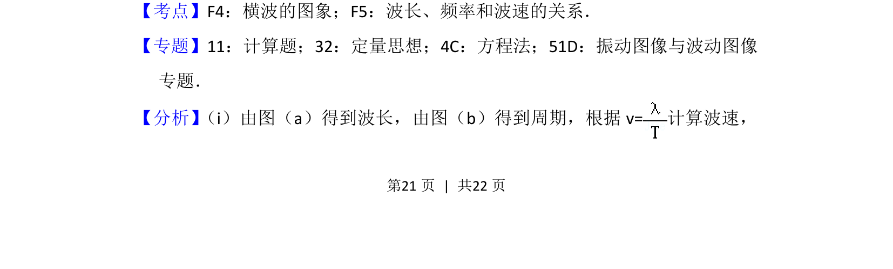
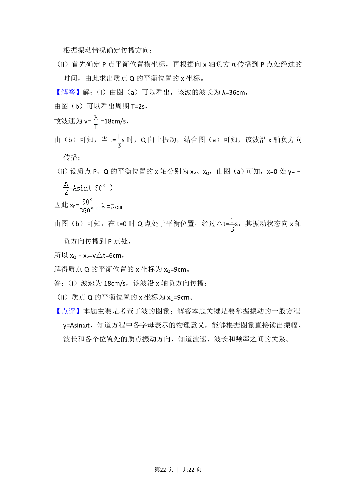

## 题面

## 摘要

根据波形图和振动图象求波速、传播方向及质点平衡位置坐标

## 关联考点

- [[630-横波的图象|横波的图象]]
- [[648-波长频率和波速的关系|波长频率和波速的关系]]
- [[804-振动图像与波动图像|振动图像与波动图像]]

## 答案与解析

> 📄 原 PDF 第 21 页：`素材/真题/湖南/2008-2024·（湖南）物理高考真题/2018年高考物理试卷（新课标Ⅰ）（解析卷）.pdf`
