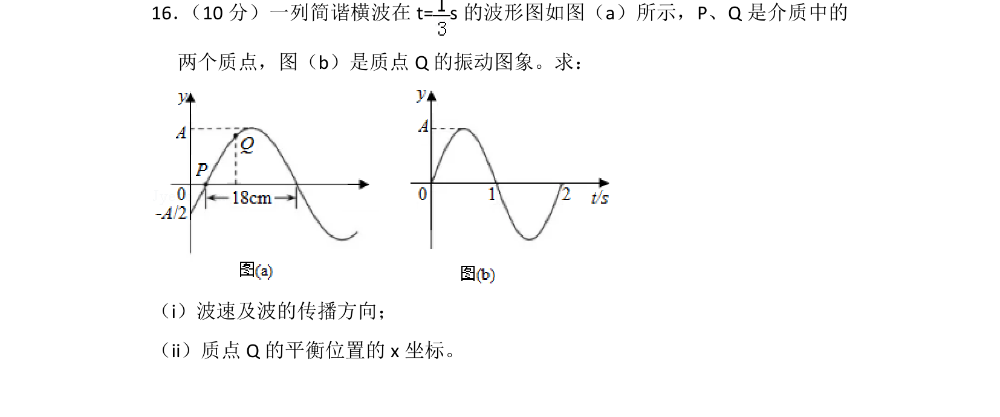
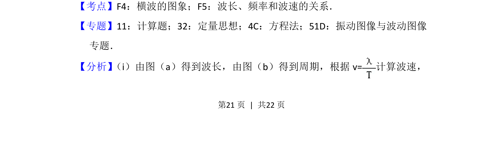
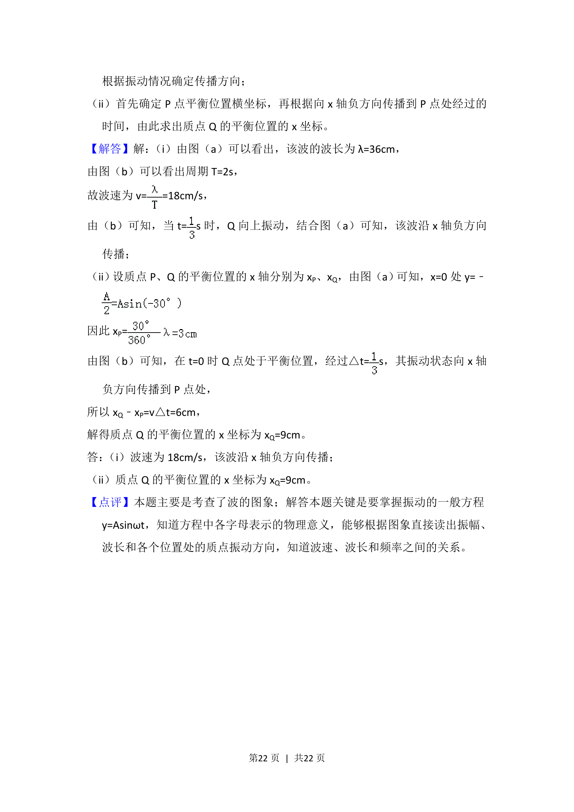

## 题面

## 摘要

根据波形图和振动图象求波速、传播方向及质点平衡位置坐标

## 关联考点

- [[630-横波的图象|横波的图象]]
- [[648-波长频率和波速的关系|波长频率和波速的关系]]
- [[804-振动图像与波动图像|振动图像与波动图像]]

## 答案与解析

> 📄 原 PDF 第 21 页：`素材/真题/湖南/2008-2024·（湖南）物理高考真题/2018年高考物理试卷（新课标Ⅰ）（解析卷）.pdf`

<!-- 题干文本-start -->
## 题干文本
16． （10分）一列简谐横波在t= s的波形图如图（a）所示，P、Q是介质中的
两个质点，图（b）是质点Q的振动图象。求：
（i）波速及波的传播方向；
（ii）质点Q的平衡位置的x坐标。
<!-- 题干文本-end -->

<!-- 解析文本-start -->
## 解析文本
【考点】F4：横波的图象；F5：波长、频率和波速的关系．菁优网版权所有
【专题】11：计算题；32：定量思想；4C：方程法；51D：振动图像与波动图像
专题．
【分析】 （i）由图（a）得到波长，由图（b）得到周期，根据v=计算波速，
<!-- 解析文本-end -->
