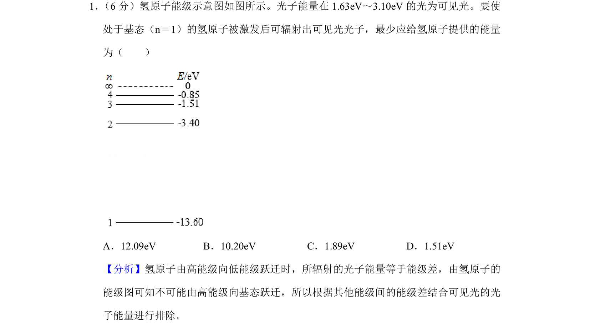
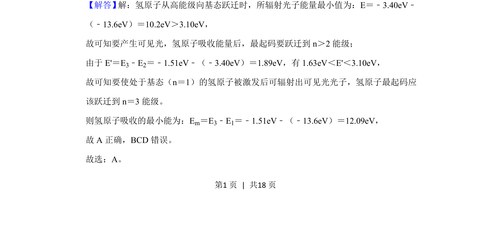
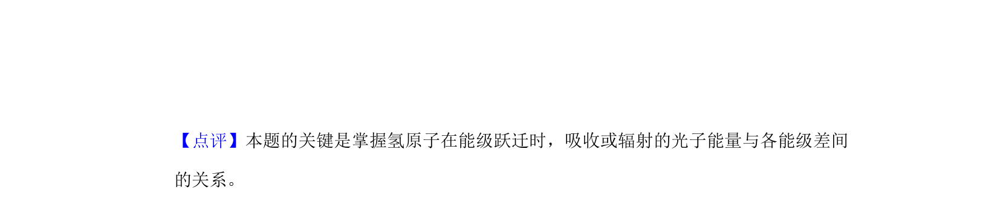

## 题面

## 摘要

氢原子能级跃迁与可见光光子能量范围结合，求基态氢原子激发的最小吸收能量。

## 关联考点

- [[436-氢原子能级|氢原子能级]]
- [[719-能级跃迁|能级跃迁]]
- [[453-光子能量|光子能量]]
- [[可见光范围]]

## 答案与解析

> 📄 原 PDF 第 1 页：`素材/真题/湖南/2008-2024·（湖南）物理高考真题/2019年高考物理试卷（新课标Ⅰ）（解析卷）.pdf`
