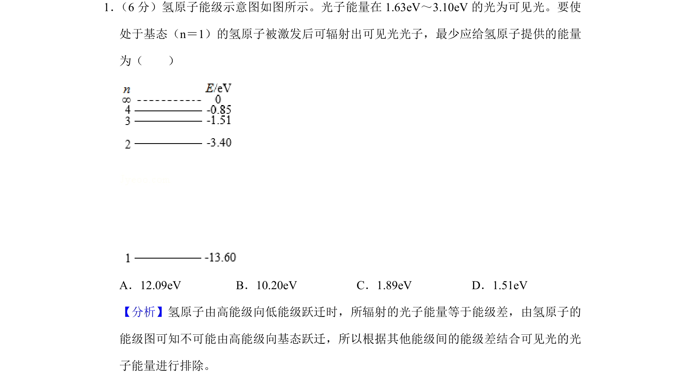
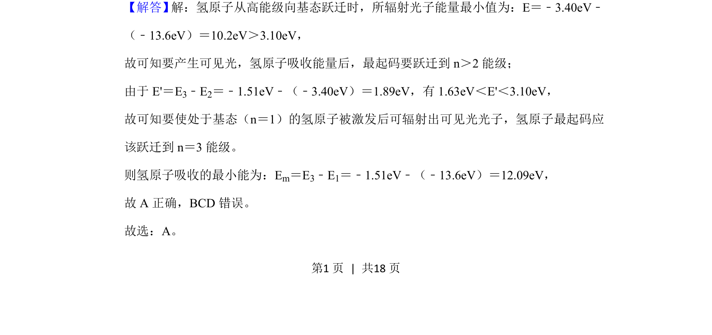
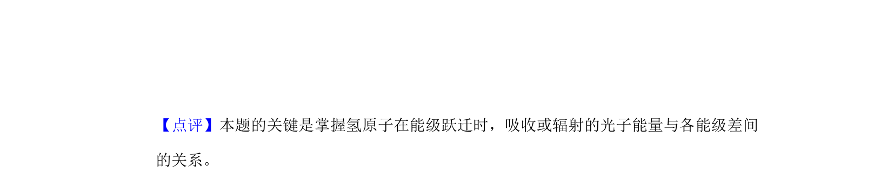

## 题面

## 摘要

氢原子能级跃迁与可见光光子能量范围结合，求基态氢原子激发的最小吸收能量。

## 关联考点

- [[436-氢原子能级|氢原子能级]]
- [[719-能级跃迁|能级跃迁]]
- [[453-光子能量|光子能量]]
- [[可见光范围]]

## 答案与解析

> 📄 原 PDF 第 1 页：`素材/真题/湖南/2008-2024·（湖南）物理高考真题/2019年高考物理试卷（新课标Ⅰ）（解析卷）.pdf`

<!-- 题干文本-start -->
## 题干文本
1． （6分）氢原子能级示意图如图所示。光子能量在1.63eV～3.10eV的光为可见光。要使
处于基态（n＝1）的氢原子被激发后可辐射出可见光光子，最少应给氢原子提供的能量
为（　　）
A．12.09eV B．10.20eV C．1.89eV D．1.51eV
<!-- 题干文本-end -->

<!-- 解析文本-start -->
## 解析文本
【分析】氢原子由高能级向低能级跃迁时，所辐射的光子能量等于能级差，由氢原子的
能级图可知不可能由高能级向基态跃迁，所以根据其他能级间的能级差结合可见光的光
子能量进行排除。
【解答】 解：氢原子从高能级向基态跃迁时，所辐射光子能量最小值为：E＝﹣3.40eV﹣
（﹣13.6eV）＝10.2eV＞3.10eV，
故可知要产生可见光，氢原子吸收能量后，最起码要跃迁到n＞2能级；
由于E'＝E 3﹣E2＝﹣1.51eV﹣（﹣3.40eV）＝1.89eV，有1.63eV＜E'＜3.10eV，
故可知要使处于基态（n＝1）的氢原子被激发后可辐射出可见光光子，氢原子最起码应
该跃迁到n＝3能级。
则氢原子吸收的最小能为：Em＝E3﹣E1＝﹣1.51eV﹣（﹣13.6eV）＝12.09eV，
故A正确，BCD错误。
故选：A。
<!-- 解析文本-end -->
