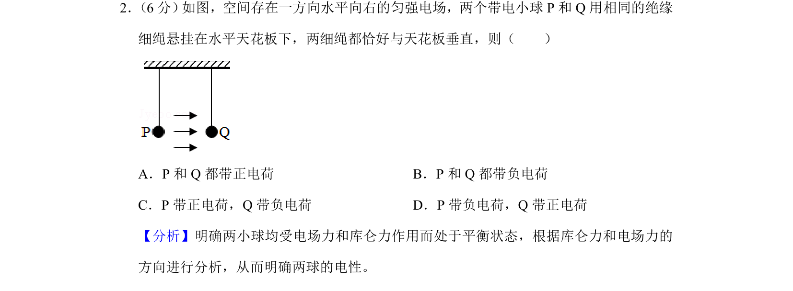
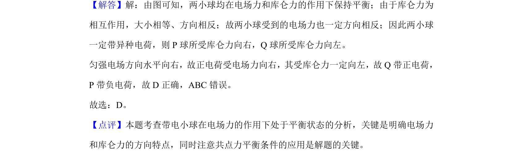

## 题面

## 摘要

两带电小球在匀强电场中平衡，绳竖直，通过电场力与库仑力方向推断电荷电性。

## 关联考点

- [[672-电场力|电场力]]
- [[库仑力]]
- [[208-共点力平衡|共点力平衡]]
- [[电荷电性]]

## 答案与解析

> 📄 原 PDF 第 2 页：`素材/真题/湖南/2008-2024·（湖南）物理高考真题/2019年高考物理试卷（新课标Ⅰ）（解析卷）.pdf`
