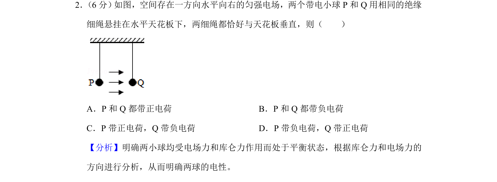
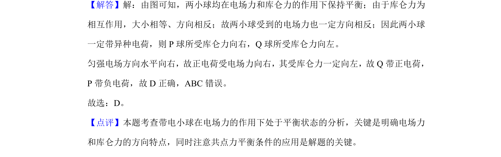

## 题面

## 摘要

两带电小球在匀强电场中平衡，绳竖直，通过电场力与库仑力方向推断电荷电性。

## 关联考点

- [[672-电场力|电场力]]
- [[库仑力]]
- [[208-共点力平衡|共点力平衡]]
- [[电荷电性]]

## 答案与解析

> 📄 原 PDF 第 2 页：`素材/真题/湖南/2008-2024·（湖南）物理高考真题/2019年高考物理试卷（新课标Ⅰ）（解析卷）.pdf`

<!-- 题干文本-start -->
## 题干文本
2． （6分） 如图，空间存在一方向水平向右的匀强电场，两个带电小球P和Q用相同的绝缘
细绳悬挂在水平天花板下，两细绳都恰好与天花板垂直，则（　　）
A．P和Q都带正电荷B．P和Q都带负电荷
C．P带正电荷，Q带负电荷D．P带负电荷，Q带正电荷
<!-- 题干文本-end -->

<!-- 解析文本-start -->
## 解析文本
【分析】明确两小球均受电场力和库仑力作用而处于平衡状态，根据库仑力和电场力的
方向进行分析，从而明确两球的电性。
【解答】解：由图可知，两小球均在电场力和库仑力的作用下保持平衡；由于库仑力为
相互作用，大小相等、方向相反；故两小球受到的电场力也一定方向相反；因此两小球
一定带异种电荷，则P球所受库仑力向右，Q球所受库仑力向左。
匀强电场方向水平向右，故正电荷受电场力向右，其受库仑力一定向左，故Q带正电荷，
P带负电荷，故D正确，ABC错误。
故选：D。
【点评】本题考查带电小球在电场力的作用下处于平衡状态的分析，关键是明确电场力
和库仑力的方向特点，同时注意共点力平衡条件的应用是解题的关键。
<!-- 解析文本-end -->
