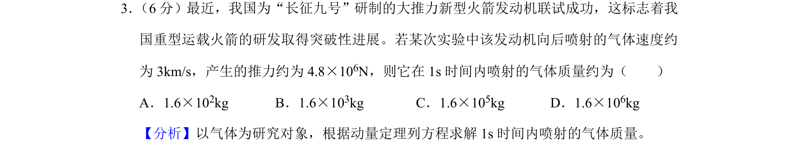
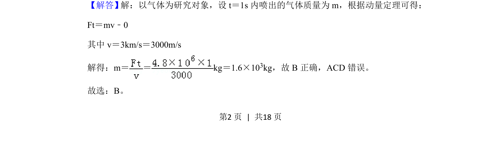
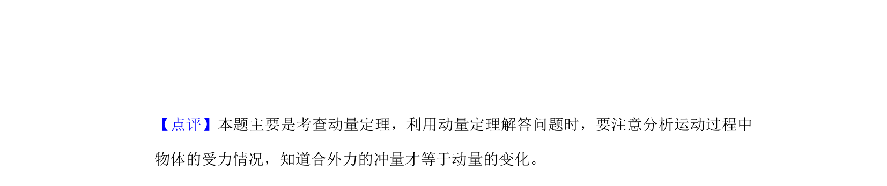

## 题面

## 摘要

火箭发动机推力与喷射气体质量的关系，应用动量定理计算单位时间喷气质量。

## 关联考点

- [[349-动量定理|动量定理]]
- [[353-反冲运动|反冲运动]]
- [[变质量动力学]]

## 答案与解析

> 📄 原 PDF 第 2 页：`素材/真题/湖南/2008-2024·（湖南）物理高考真题/2019年高考物理试卷（新课标Ⅰ）（解析卷）.pdf`
