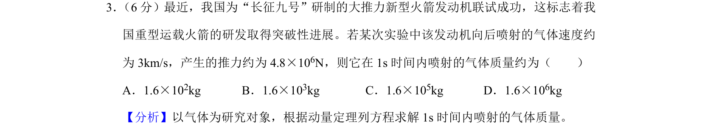
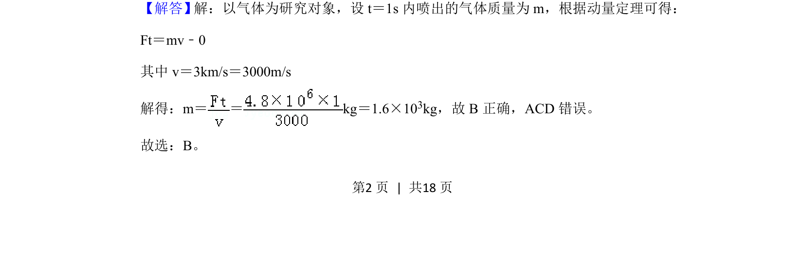
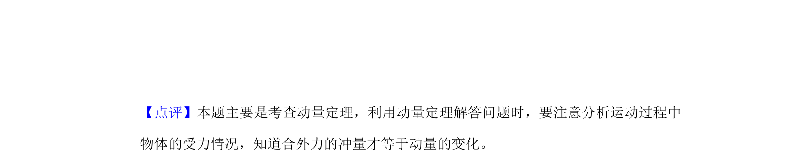

## 题面

## 摘要

火箭发动机推力与喷射气体质量的关系，应用动量定理计算单位时间喷气质量。

## 关联考点

- [[349-动量定理|动量定理]]
- [[353-反冲运动|反冲运动]]
- [[变质量动力学]]

## 答案与解析

> 📄 原 PDF 第 2 页：`素材/真题/湖南/2008-2024·（湖南）物理高考真题/2019年高考物理试卷（新课标Ⅰ）（解析卷）.pdf`

<!-- 题干文本-start -->
## 题干文本
3． （6分）最近，我国为“长征九号”研制的大推力新型火箭发动机联试成功，这标志着我
国重型运载火箭的研发取得突破性进展。若某次实验中该发动机向后喷射的气体速度约
为3km/s，产生的推力约为4.8×10 6N，则它在1s时间内喷射的气体质量约为（　　）
A．1.6×102kg B．1.6×10 3kg C．1.6×10 5kg D．1.6×10 6kg
<!-- 题干文本-end -->

<!-- 解析文本-start -->
## 解析文本
【分析】以气体为研究对象，根据动量定理列方程求解1s时间内喷射的气体质量。
【解答】解：以气体为研究对象，设t＝1s内喷出的气体质量为m，根据动量定理可得：
Ft＝mv﹣0
其中v＝3km/s＝3000m/s
解得：m＝ ＝kg＝1.6×10 3kg，故B正确，ACD错误。
故选：B。
<!-- 解析文本-end -->
