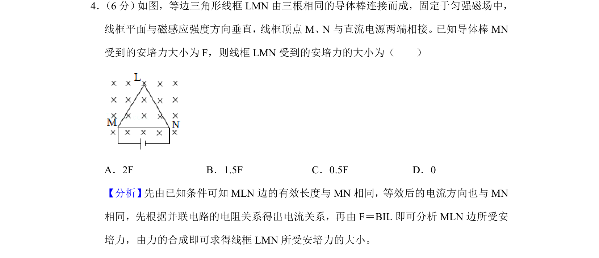
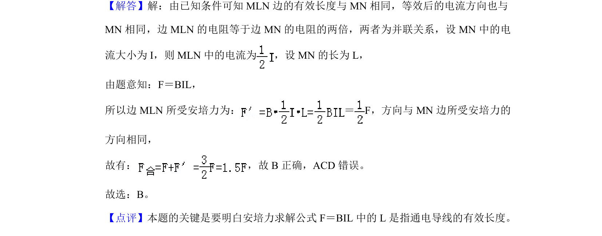

## 题面

## 摘要

等边三角形线框在匀强磁场中的安培力计算，涉及等效长度和并联电路电流分配。

## 关联考点

- [[188-磁场对通电导体的作用|安培力]]
- [[等效长度]]
- [[139-并联电路|并联电路]]

## 答案与解析

> 📄 原 PDF 第 3 页：`素材/真题/湖南/2008-2024·（湖南）物理高考真题/2019年高考物理试卷（新课标Ⅰ）（解析卷）.pdf`
