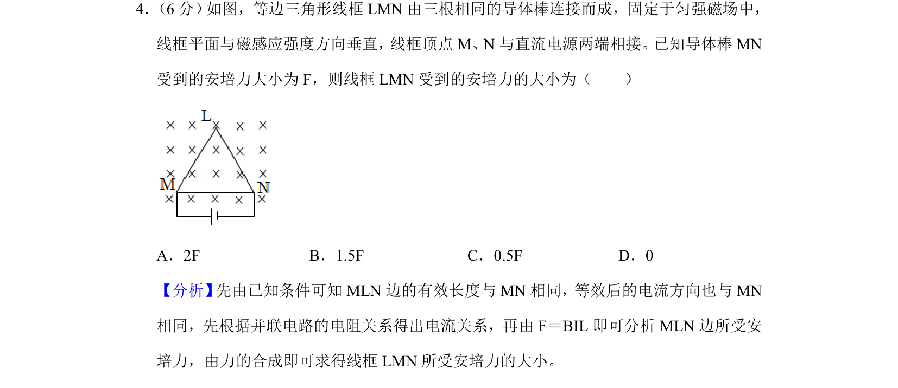
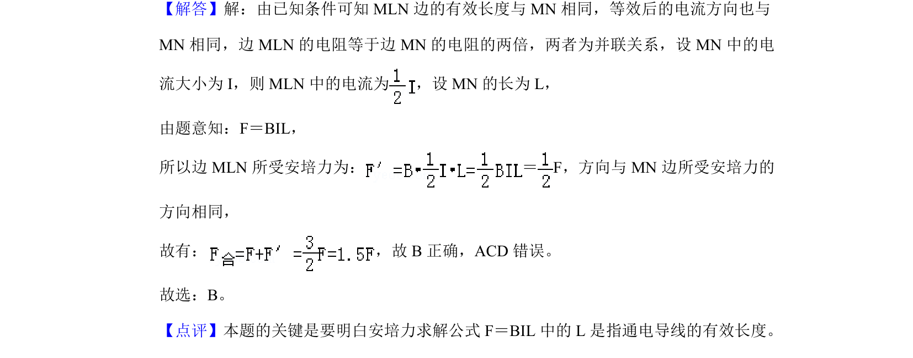

## 题面

## 摘要

等边三角形线框在匀强磁场中的安培力计算，涉及等效长度和并联电路电流分配。

## 关联考点

- [[188-磁场对通电导体的作用|安培力]]
- [[等效长度]]
- [[139-并联电路|并联电路]]

## 答案与解析

> 📄 原 PDF 第 3 页：`素材/真题/湖南/2008-2024·（湖南）物理高考真题/2019年高考物理试卷（新课标Ⅰ）（解析卷）.pdf`

<!-- 题干文本-start -->
## 题干文本
4． （6分） 如图，等边三角形线框LMN由三根相同的导体棒连接而成，固定于匀强磁场中，
线框平面与磁感应强度方向垂直， 线框顶点M、N与直流电源两端相接。 已知导体棒MN
受到的安培力大小为F，则线框LMN受到的安培力的大小为（　　）
A．2F B．1.5F C．0.5F D．0
<!-- 题干文本-end -->

<!-- 解析文本-start -->
## 解析文本
【分析】 先由已知条件可知MLN边的有效长度与MN相同，等效后的电流方向也与MN
相同，先根据并联电路的电阻关系得出电流关系，再由F＝BIL即可分析MLN边所受安
培力，由力的合成即可求得线框LMN所受安培力的大小。
【解答】解：由已知条件可知MLN边的有效长度与MN相同，等效后的电流方向也与
MN相同，边MLN的电阻等于边MN的电阻的两倍，两者为并联关系，设MN中的电
流大小为I，则MLN中的电流为 ，设MN的长为L，
由题意知：F＝BIL，
所以边MLN所受安培力为： ＝F，方向与MN边所受安培力的
方向相同，
故有： ，故B正确，ACD错误。
故选：B。
【点评】本题的关键是要明白安培力求解公式F＝BIL中的L是指通电导线的有效长度。
<!-- 解析文本-end -->
