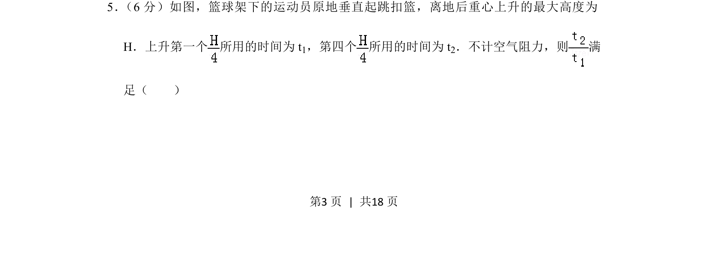
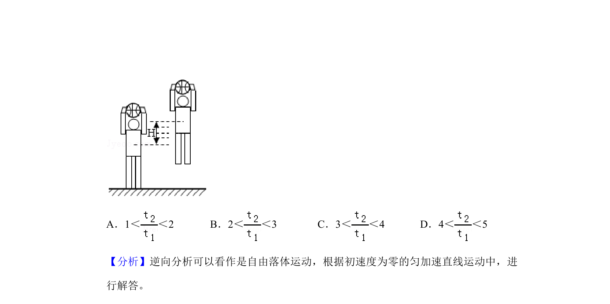
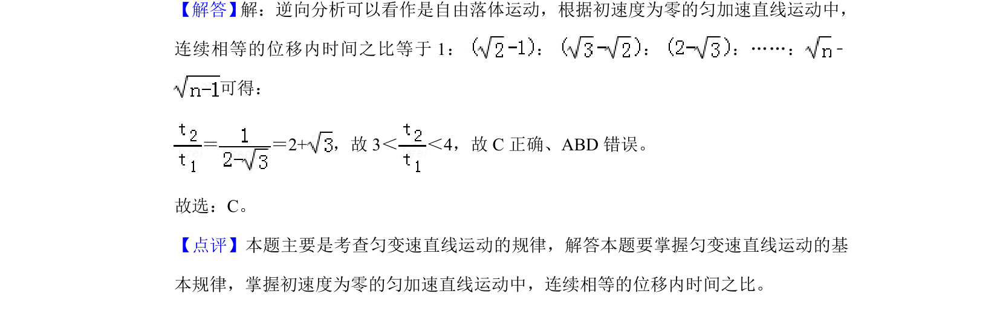

## 题面

## 摘要

运动员垂直起跳扣篮，上升最大高度H，求上升第一个H/4与第四个H/4所用时间之比满足的条件。

## 关联考点

- [[706-竖直上抛运动|竖直上抛运动]]
- [[215-匀变速直线运动|匀变速直线运动]]
- [[等位移时间比]]

## 答案与解析

> 📄 原 PDF 第 3 页：`素材/真题/湖南/2008-2024·（湖南）物理高考真题/2019年高考物理试卷（新课标Ⅰ）（解析卷）.pdf`
