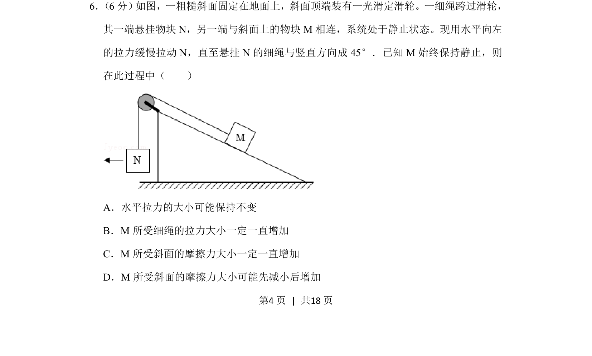
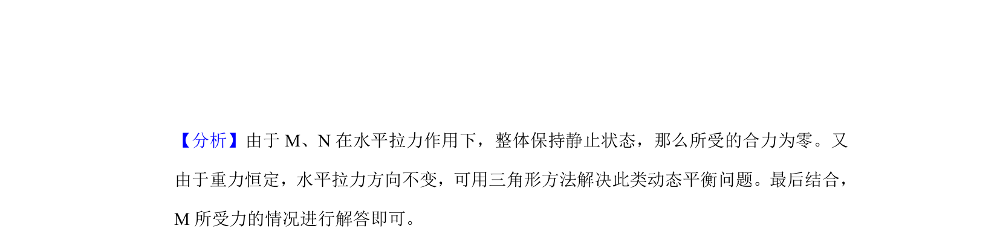
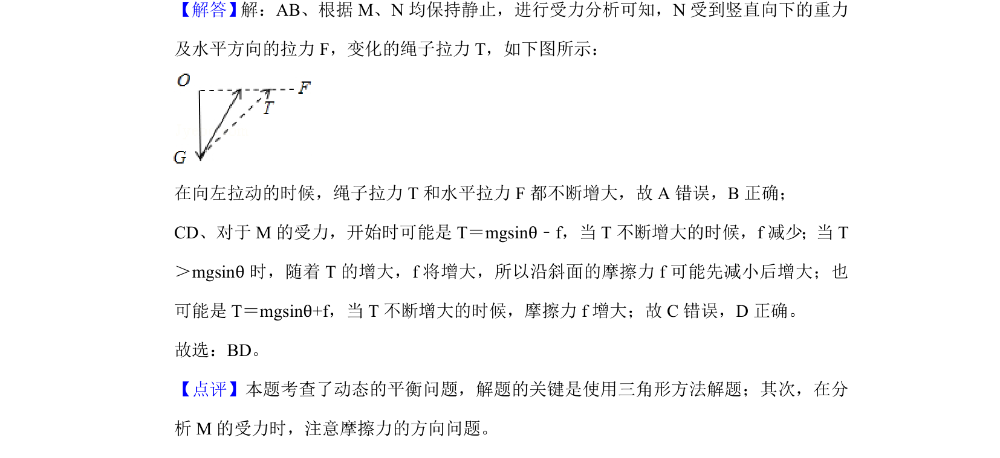

## 题面

## 摘要

系统处于静止状态，通过缓慢拉动N分析绳中拉力变化及M所受摩擦力变化，考查动态平衡受力分析。

## 关联考点

- [[284-化学平衡|动态平衡]]
- [[532-力的合成与分解|力的合成与分解]]
- [[081-摩擦力|摩擦力]]
- [[208-共点力平衡|共点力平衡]]

## 答案与解析

> 📄 原 PDF 第 4 页：`素材/真题/湖南/2008-2024·（湖南）物理高考真题/2019年高考物理试卷（新课标Ⅰ）（解析卷）.pdf`
