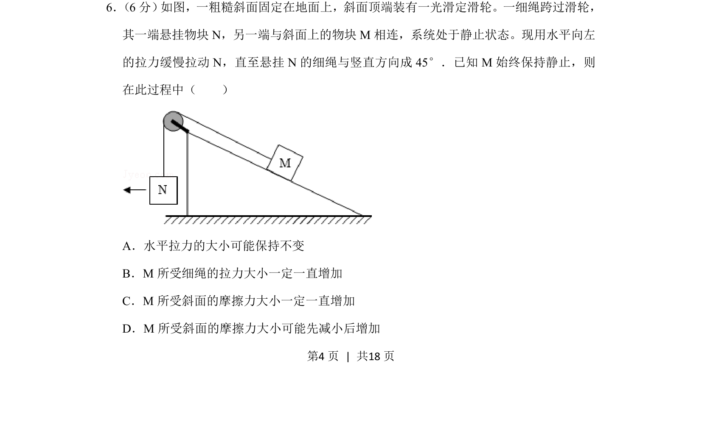
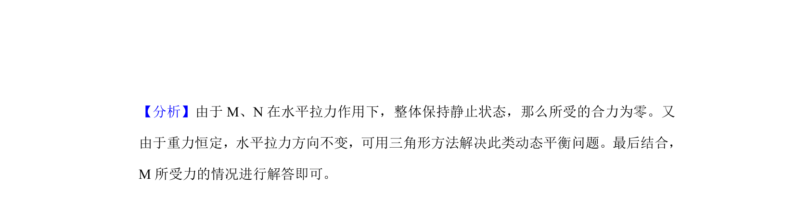
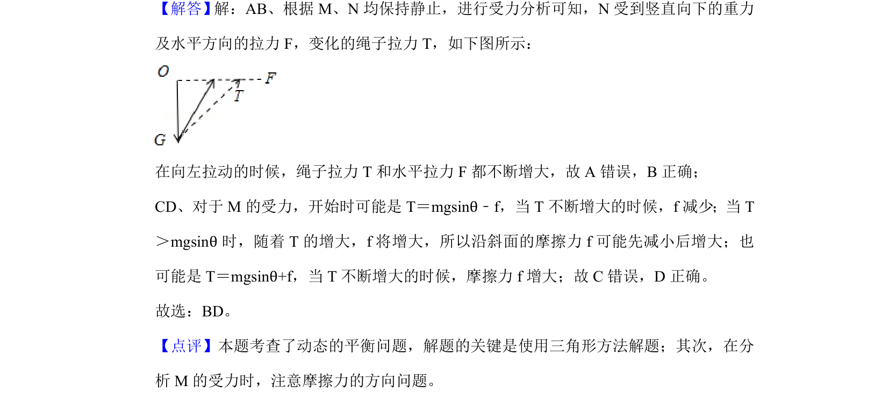

## 题面

## 摘要

系统处于静止状态，通过缓慢拉动N分析绳中拉力变化及M所受摩擦力变化，考查动态平衡受力分析。

## 关联考点

- [[284-化学平衡|动态平衡]]
- [[532-力的合成与分解|力的合成与分解]]
- [[081-摩擦力|摩擦力]]
- [[208-共点力平衡|共点力平衡]]

## 答案与解析

> 📄 原 PDF 第 4 页：`素材/真题/湖南/2008-2024·（湖南）物理高考真题/2019年高考物理试卷（新课标Ⅰ）（解析卷）.pdf`

<!-- 题干文本-start -->
## 题干文本
6． （6分） 如图，一粗糙斜面固定在地面上，斜面顶端装有一光滑定滑轮。一细绳跨过滑轮，
其一端悬挂物块N，另一端与斜面上的物块M相连，系统处于静止状态。现用水平向左
的拉力缓慢拉动N，直至悬挂N的细绳与竖直方向成45°．已知M始终保持静止，则
在此过程中（　　）
A．水平拉力的大小可能保持不变
B．M所受细绳的拉力大小一定一直增加
C．M所受斜面的摩擦力大小一定一直增加
D．M所受斜面的摩擦力大小可能先减小后增加
<!-- 题干文本-end -->

<!-- 解析文本-start -->
## 解析文本

<!-- 解析文本-end -->
