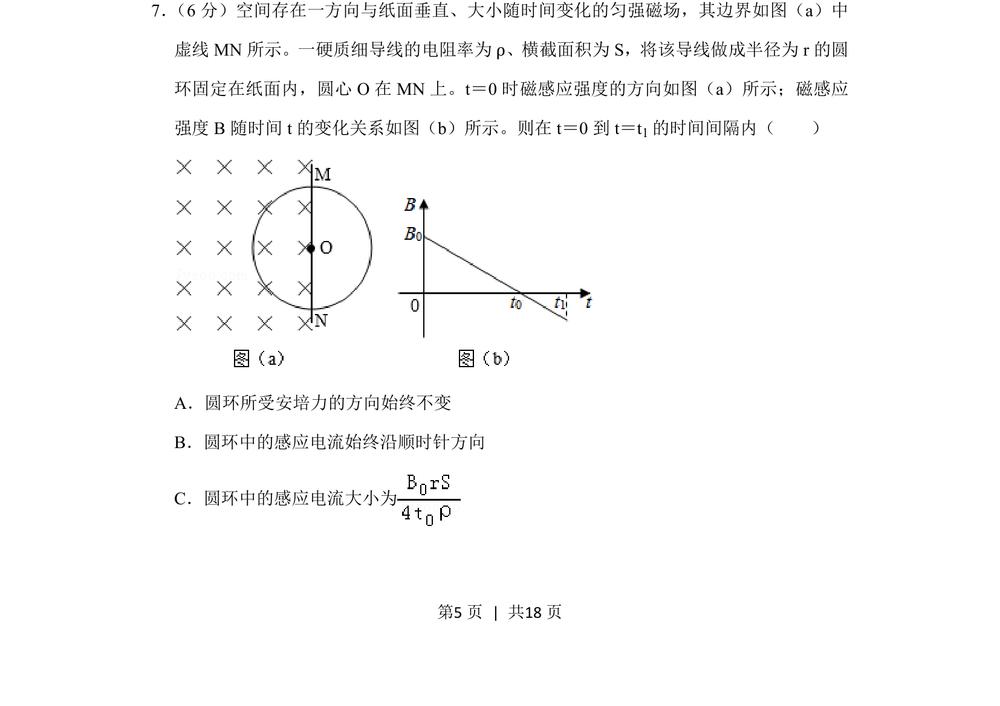
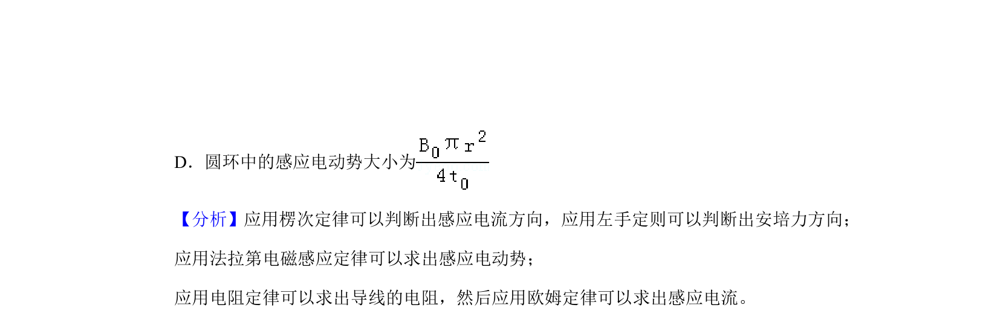
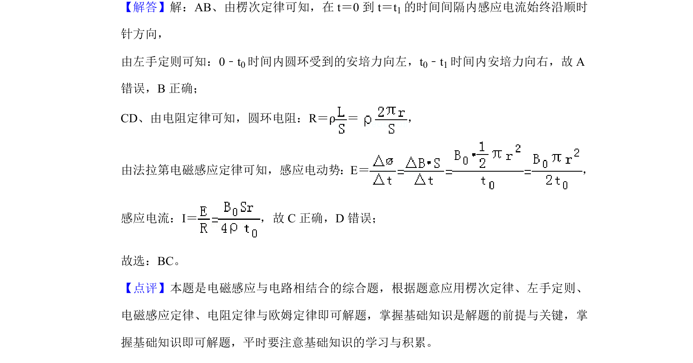

## 题面

## 摘要

圆环在变化磁场中产生感应电流，判断安培力方向、感应电流方向及大小

## 关联考点

- [[395-法拉第电磁感应定律|法拉第电磁感应定律]]
- [[393-楞次定律|楞次定律]]
- [[188-磁场对通电导体的作用|安培力]]
- [[318-电阻定律|电阻定律]]

## 答案与解析

> 📄 原 PDF 第 5 页：`素材/真题/湖南/2008-2024·（湖南）物理高考真题/2019年高考物理试卷（新课标Ⅰ）（解析卷）.pdf`
