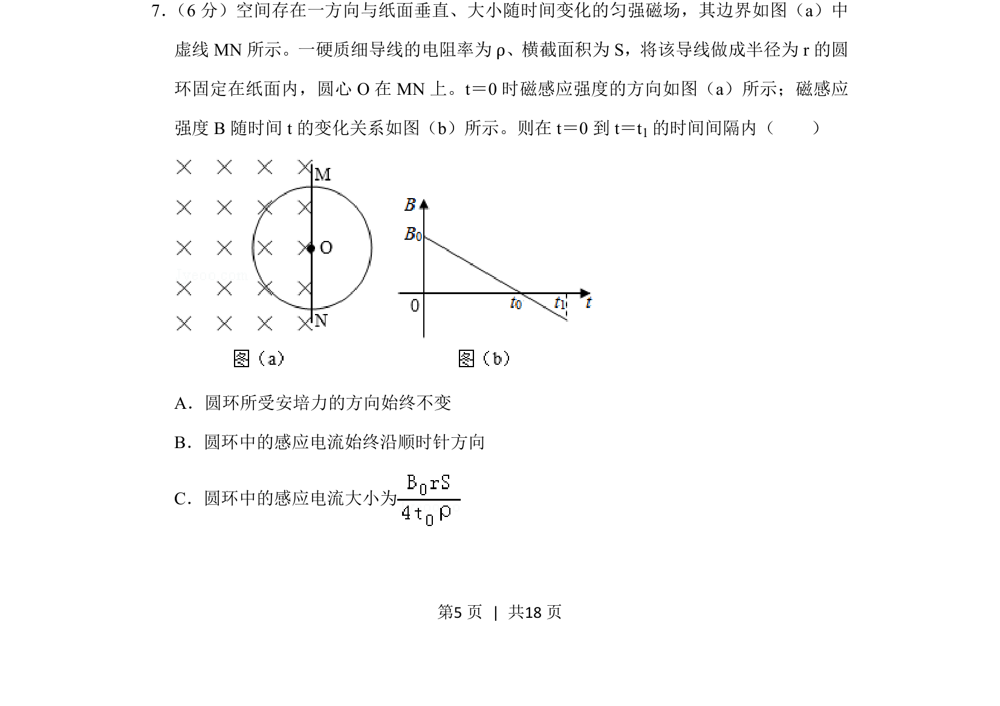
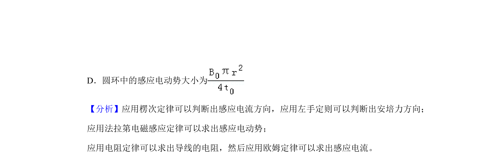
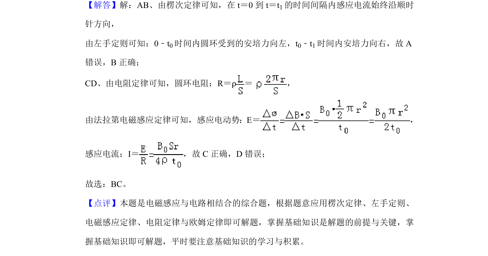

## 题面

## 摘要

圆环在变化磁场中产生感应电流，判断安培力方向、感应电流方向及大小

## 关联考点

- [[395-法拉第电磁感应定律|法拉第电磁感应定律]]
- [[393-楞次定律|楞次定律]]
- [[188-磁场对通电导体的作用|安培力]]
- [[318-电阻定律|电阻定律]]

## 答案与解析

> 📄 原 PDF 第 5 页：`素材/真题/湖南/2008-2024·（湖南）物理高考真题/2019年高考物理试卷（新课标Ⅰ）（解析卷）.pdf`

<!-- 题干文本-start -->
## 题干文本
7． （6分）空间存在一方向与纸面垂直、大小随时间变化的匀强磁场，其边界如图（a）中
虚线MN所示。一硬质细导线的电阻率为ρ、横截面积为S，将该导线做成半径为r的圆
环固定在纸面内，圆心O在MN上。t＝0时磁感应强度的方向如图（a）所示；磁感应
强度B随时间t的变化关系如图（b）所示。则在t＝0到t＝t 1的时间间隔内（　　）
A．圆环所受安培力的方向始终不变
B．圆环中的感应电流始终沿顺时针方向
C．圆环中的感应电流大小为
<!-- 题干文本-end -->

<!-- 解析文本-start -->
## 解析文本

<!-- 解析文本-end -->
