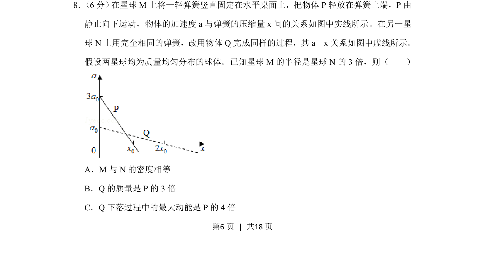
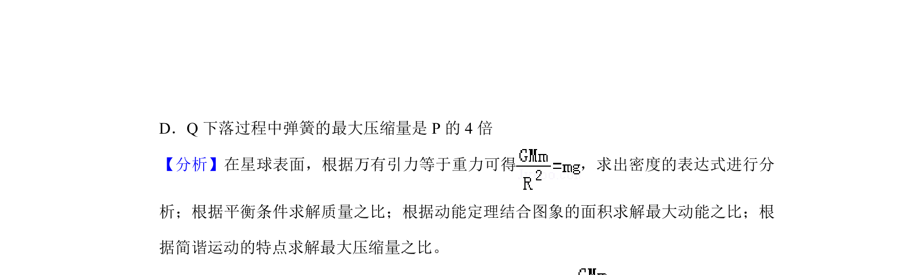
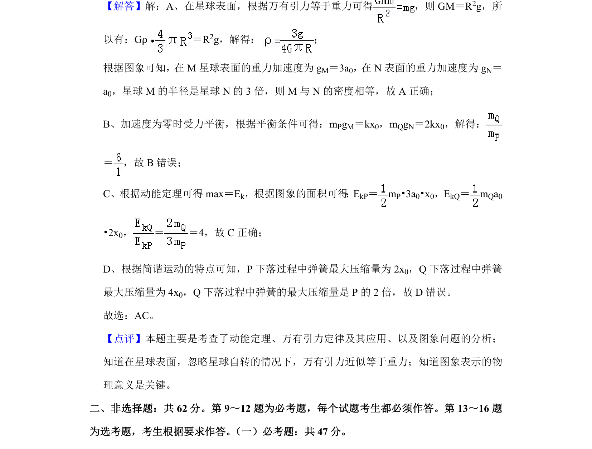

## 题面

## 摘要

一物体在弹簧上由静止释放的加速度-压缩量图像，结合星球参数比较密度、质量与最大动能。

## 关联考点

- [[229-牛顿第二定律|牛顿第二定律]]
- [[246-万有引力定律|万有引力定律]]
- [[249-功能关系|功能关系]]
- [[564-图像分析|图像分析]]

## 答案与解析

> 📄 原 PDF 第 6 页：`素材/真题/湖南/2008-2024·（湖南）物理高考真题/2019年高考物理试卷（新课标Ⅰ）（解析卷）.pdf`
