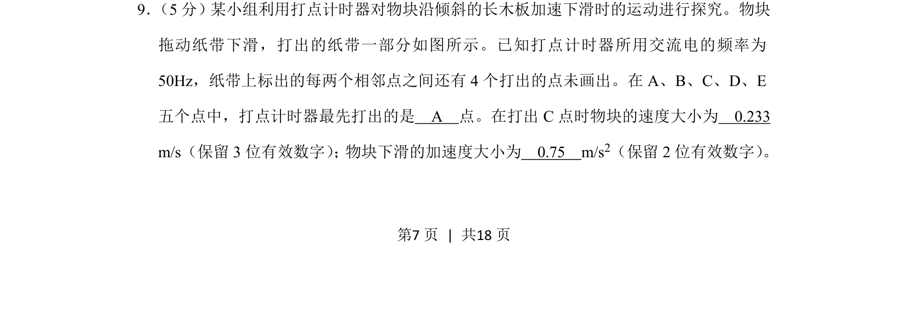
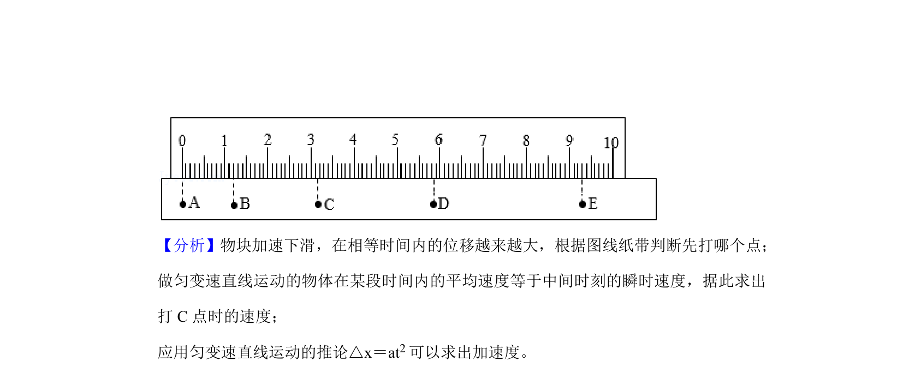
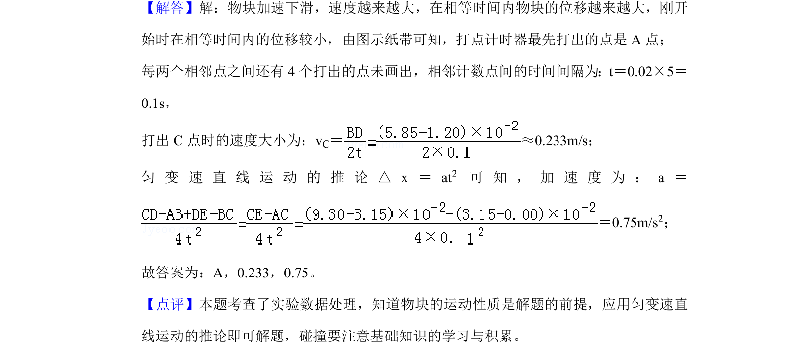

## 题面

## 摘要

探究物块沿倾斜木板加速下滑运动，利用打点计时器纸带数据求速度和加速度。

## 关联考点

- [[755-打点计时器|打点计时器]]
- [[489-纸带数据处理|纸带数据处理]]
- [[463-瞬时变化率|瞬时速度]]
- [[214-加速度|加速度]]

## 答案与解析

> 📄 原 PDF 第 7 页：`素材/真题/湖南/2008-2024·（湖南）物理高考真题/2019年高考物理试卷（新课标Ⅰ）（解析卷）.pdf`
