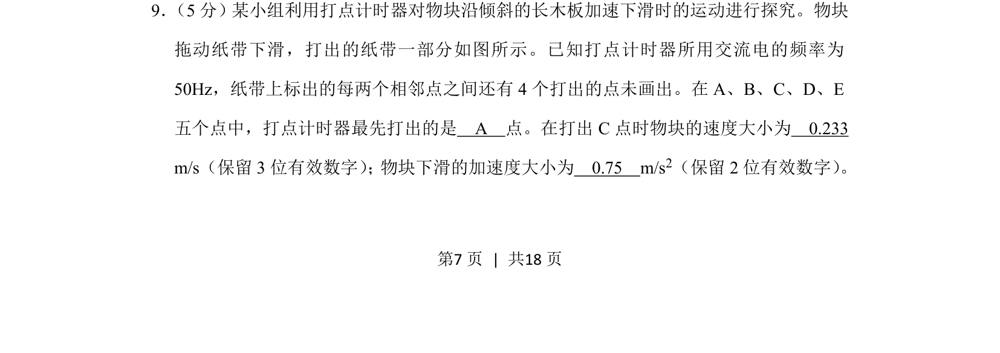
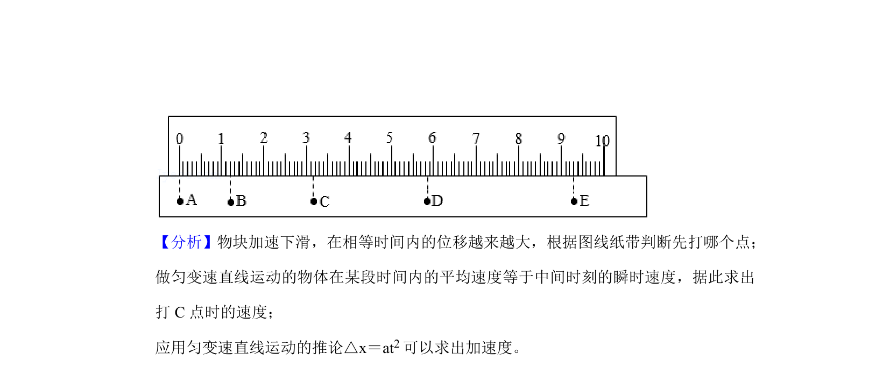
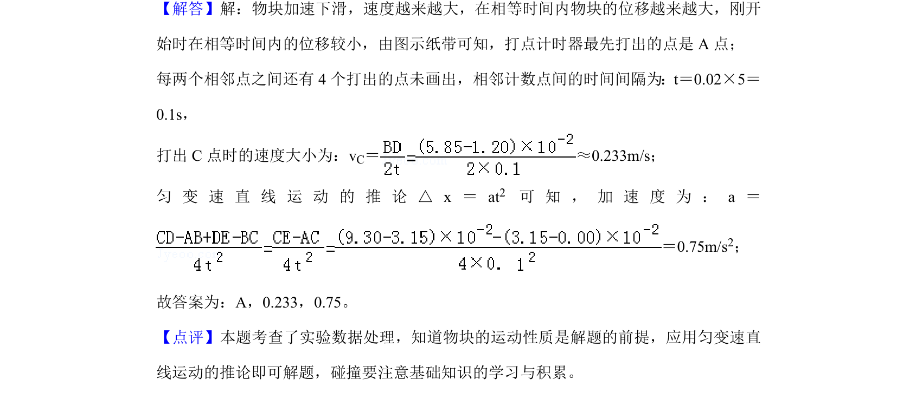

## 题面

## 摘要

探究物块沿倾斜木板加速下滑运动，利用打点计时器纸带数据求速度和加速度。

## 关联考点

- [[755-打点计时器|打点计时器]]
- [[489-纸带数据处理|纸带数据处理]]
- [[463-瞬时变化率|瞬时速度]]
- [[214-加速度|加速度]]

## 答案与解析

> 📄 原 PDF 第 7 页：`素材/真题/湖南/2008-2024·（湖南）物理高考真题/2019年高考物理试卷（新课标Ⅰ）（解析卷）.pdf`

<!-- 题干文本-start -->
## 题干文本
9． （5分）某小组利用打点计时器对物块沿倾斜的长木板加速下滑时的运动进行探究。物块
拖动纸带下滑，打出的纸带一部分如图所示。已知打点计时器所用交流电的频率为
50Hz，纸带上标出的每两个相邻点之间还有4个打出的点未画出。在A、B、C、D、E
五个点中，打点计时器最先打出的是　A　点。在打出C点时物块的速度大小为　0.233　
m/s（保留3位有效数字） ； 物块下滑的加速度大小为　0.75　m/s2（保留2位有效数字） 。
<!-- 题干文本-end -->

<!-- 解析文本-start -->
## 解析文本

<!-- 解析文本-end -->
