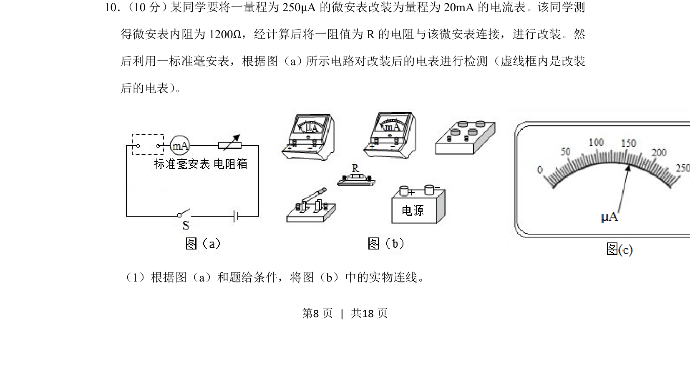
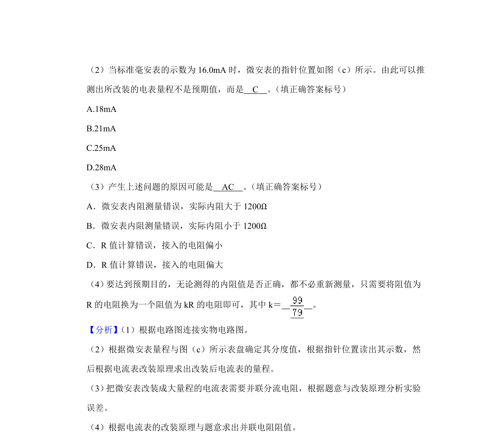
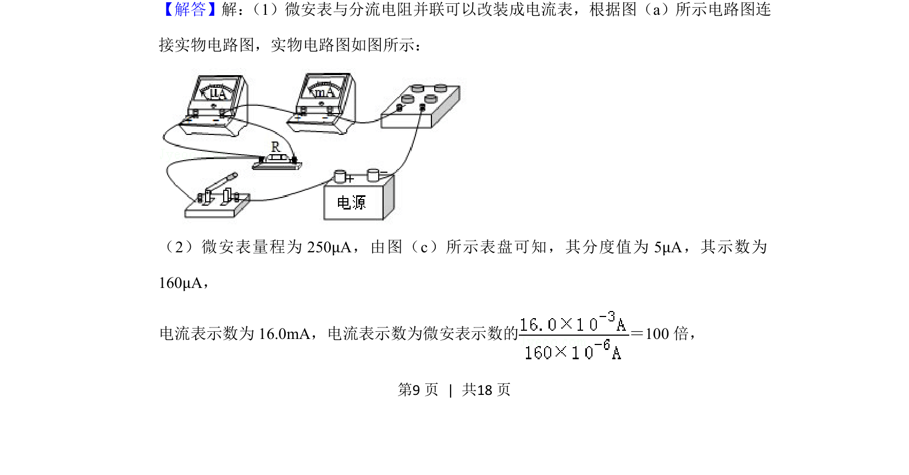
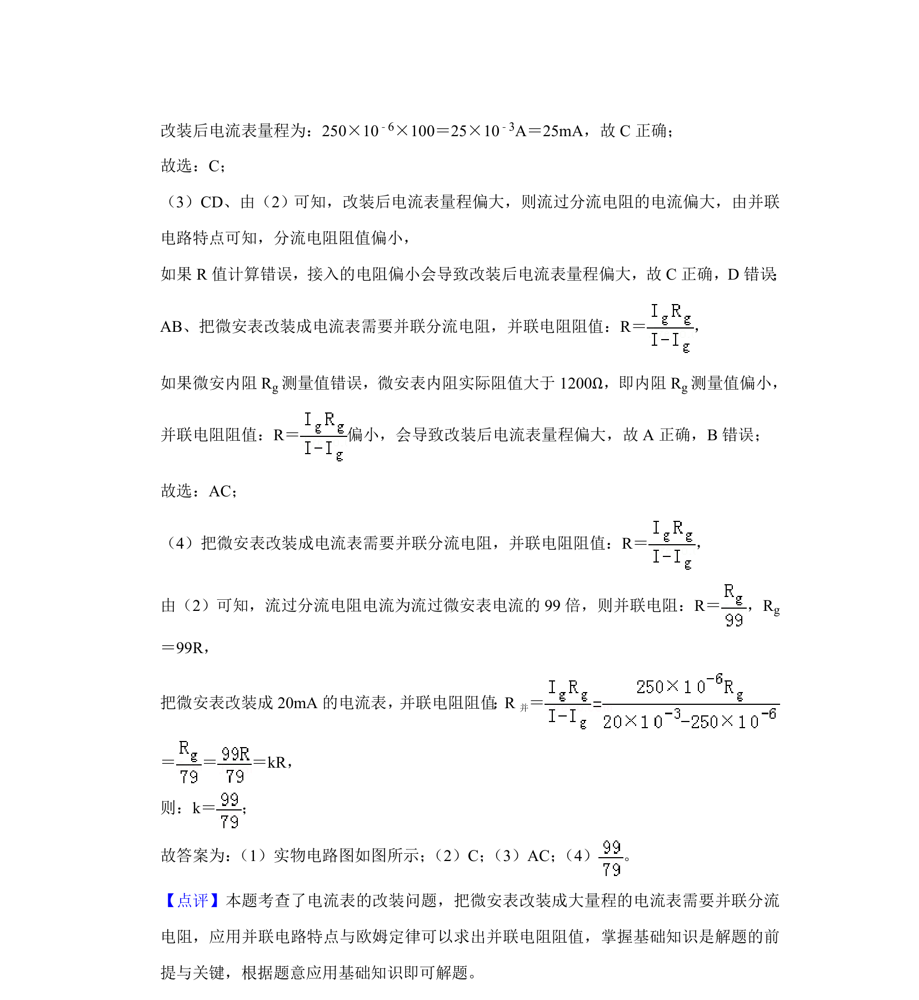

## 题面

## 摘要

考查微安表改装电流表的原理计算及实物连线，涉及分流电阻求解与电路连接操作。

## 关联考点

- [[683-电流表改装|电流表改装]]
- [[862-并联分流|并联分流]]
- [[实物连线]]
- [[141-欧姆定律-初中|欧姆定律]]

## 答案与解析

> 📄 原 PDF 第 8 页：`素材/真题/湖南/2008-2024·（湖南）物理高考真题/2019年高考物理试卷（新课标Ⅰ）（解析卷）.pdf`
