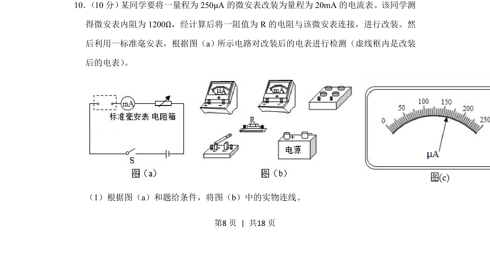
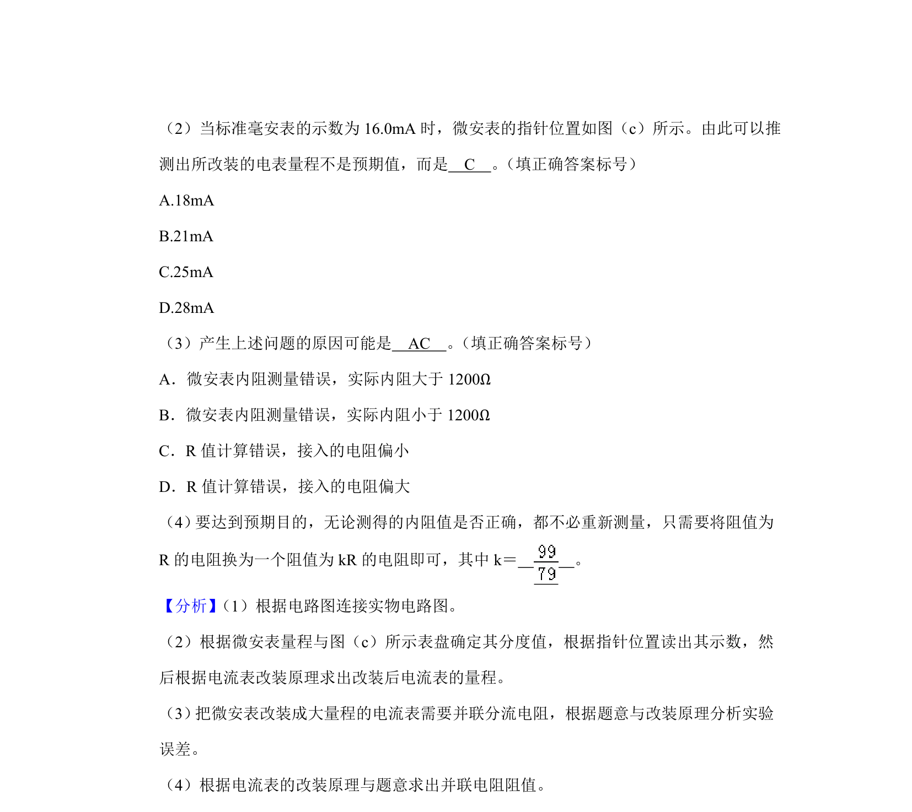
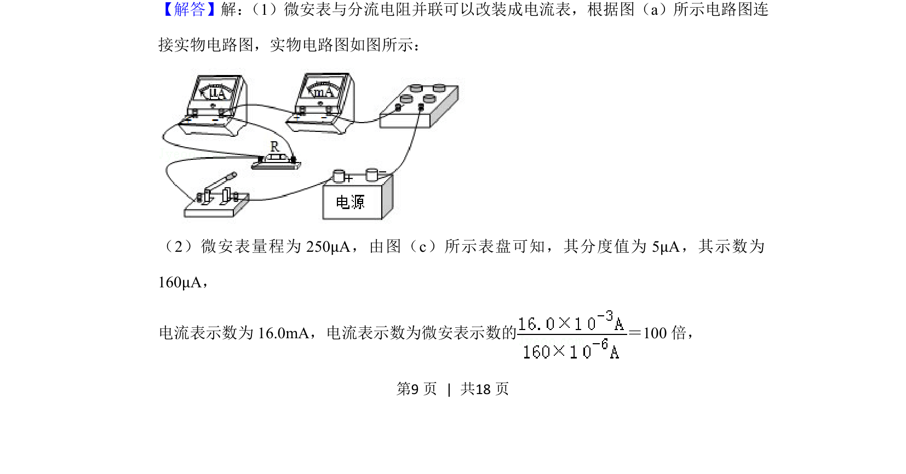
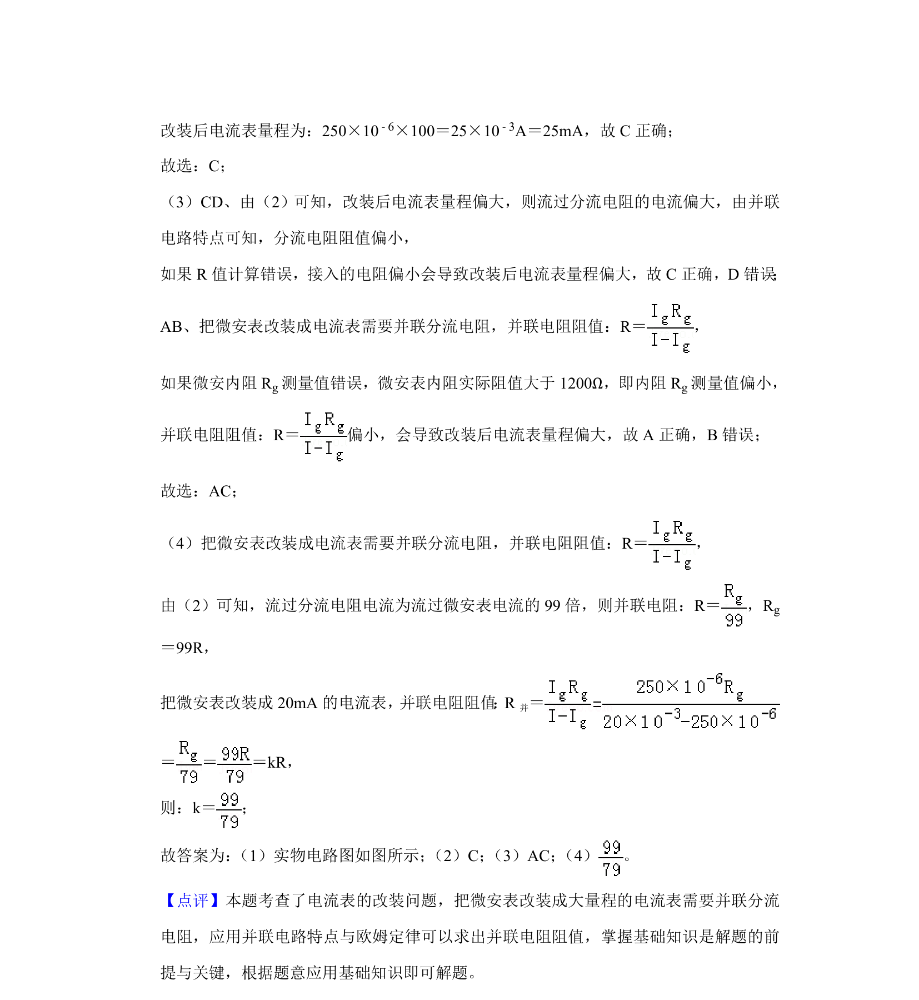

## 题面

## 摘要

考查微安表改装电流表的原理计算及实物连线，涉及分流电阻求解与电路连接操作。

## 关联考点

- [[683-电流表改装|电流表改装]]
- [[862-并联分流|并联分流]]
- [[实物连线]]
- [[141-欧姆定律-初中|欧姆定律]]

## 答案与解析

> 📄 原 PDF 第 8 页：`素材/真题/湖南/2008-2024·（湖南）物理高考真题/2019年高考物理试卷（新课标Ⅰ）（解析卷）.pdf`

<!-- 题干文本-start -->
## 题干文本
10． （10分） 某同学要将一量程为250μA的微安表改装为量程为20mA的电流表。该同学测
得微安表内阻为1200Ω，经计算后将一阻值为R的电阻与该微安表连接，进行改装。然
后利用一标准毫安表，根据图（a）所示电路对改装后的电表进行检测（虚线框内是改装
后的电表） 。
（1）根据图（a）和题给条件，将图（b）中的实物连线。
<!-- 题干文本-end -->

<!-- 解析文本-start -->
## 解析文本

<!-- 解析文本-end -->
