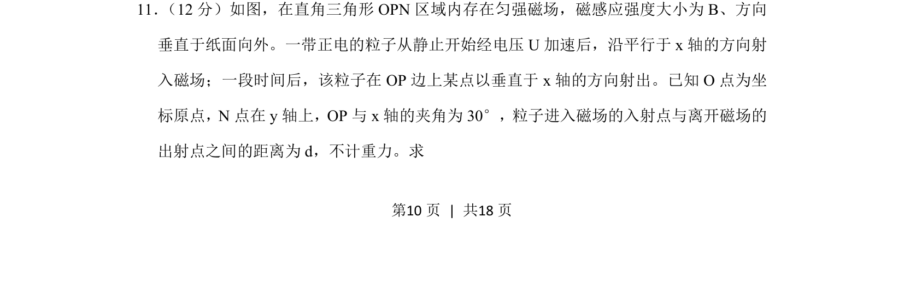
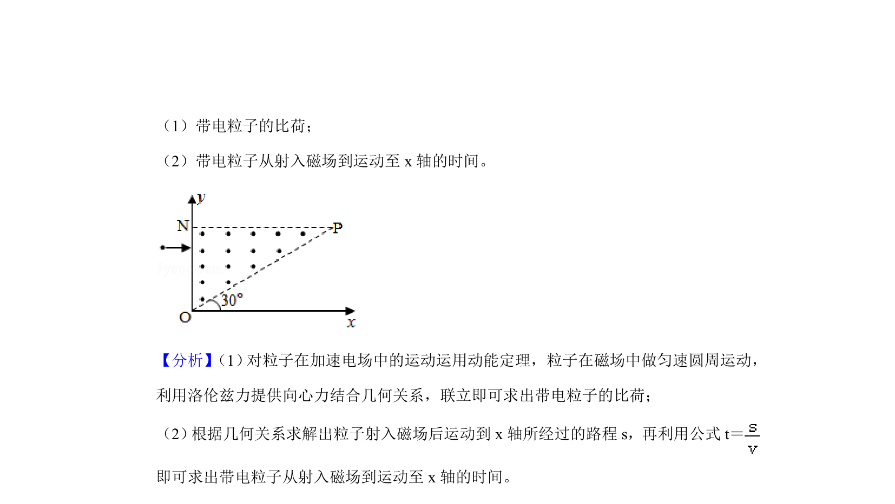
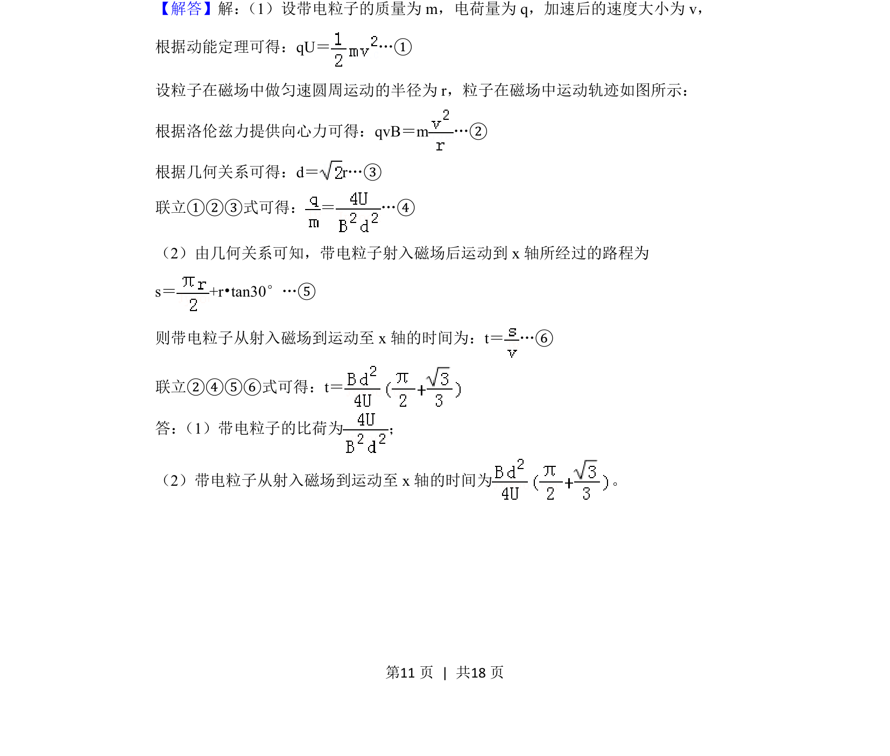
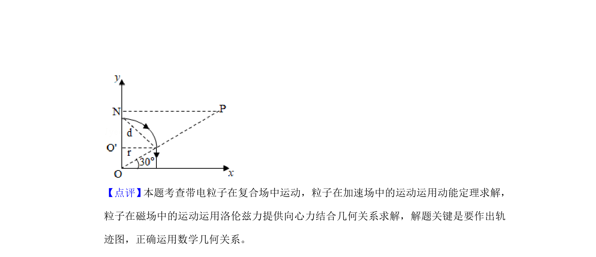

## 题面

## 摘要

带电粒子经电场加速后进入匀强磁场偏转，结合几何关系求解相关物理量。

## 关联考点

- [[251-动能定理|动能定理]]
- [[843-带电粒子在匀强磁场中的圆周运动|带电粒子在匀强磁场中的圆周运动]]
- [[456-几何关系|几何关系]]

## 答案与解析

> 📄 原 PDF 第 10 页：`素材/真题/湖南/2008-2024·（湖南）物理高考真题/2019年高考物理试卷（新课标Ⅰ）（解析卷）.pdf`
