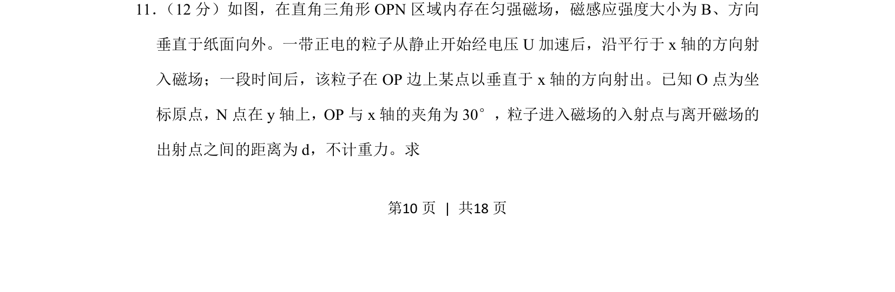
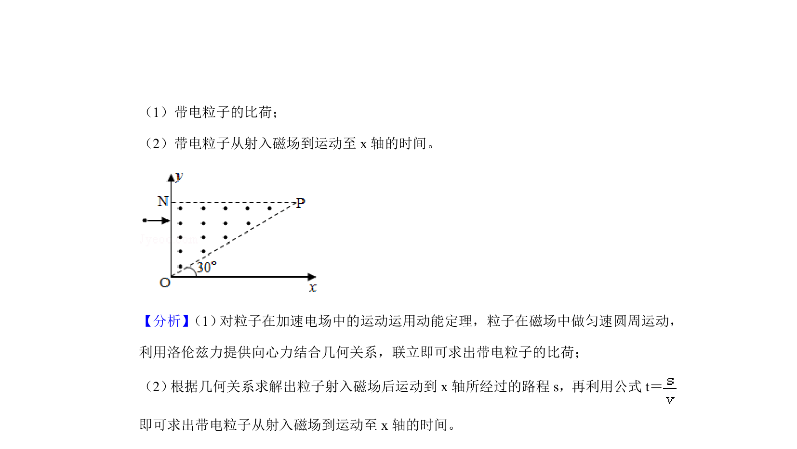
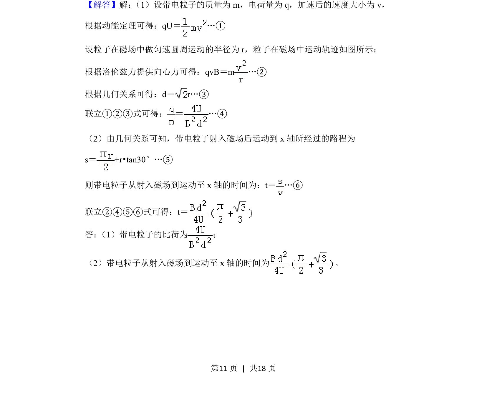
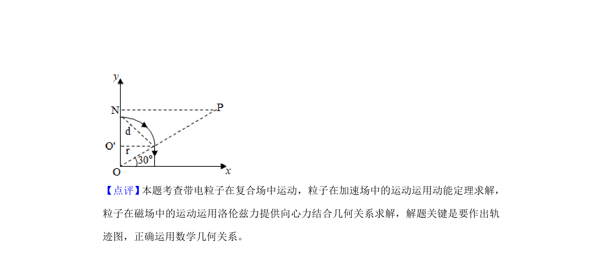

## 题面

## 摘要

带电粒子经电场加速后进入匀强磁场偏转，结合几何关系求解相关物理量。

## 关联考点

- [[251-动能定理|动能定理]]
- [[843-带电粒子在匀强磁场中的圆周运动|带电粒子在匀强磁场中的圆周运动]]
- [[456-几何关系|几何关系]]

## 答案与解析

> 📄 原 PDF 第 10 页：`素材/真题/湖南/2008-2024·（湖南）物理高考真题/2019年高考物理试卷（新课标Ⅰ）（解析卷）.pdf`

<!-- 题干文本-start -->
## 题干文本
11． （12分）如图，在直角三角形OPN区域内存在匀强磁场，磁感应强度大小为B、方向
垂直于纸面向外。一带正电的粒子从静止开始经电压U加速后，沿平行于x轴的方向射
入磁场；一段时间后，该粒子在OP边上某点以垂直于x轴的方向射出。已知O点为坐
标原点，N点在y轴上，OP与x轴的夹角为30°，粒子进入磁场的入射点与离开磁场的
出射点之间的距离为d，不计重力。求
<!-- 题干文本-end -->

<!-- 解析文本-start -->
## 解析文本

<!-- 解析文本-end -->
