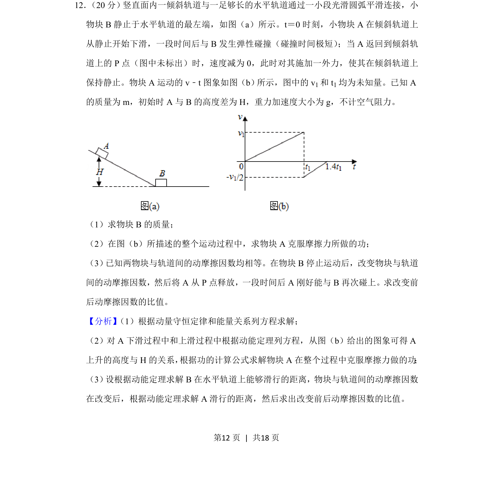
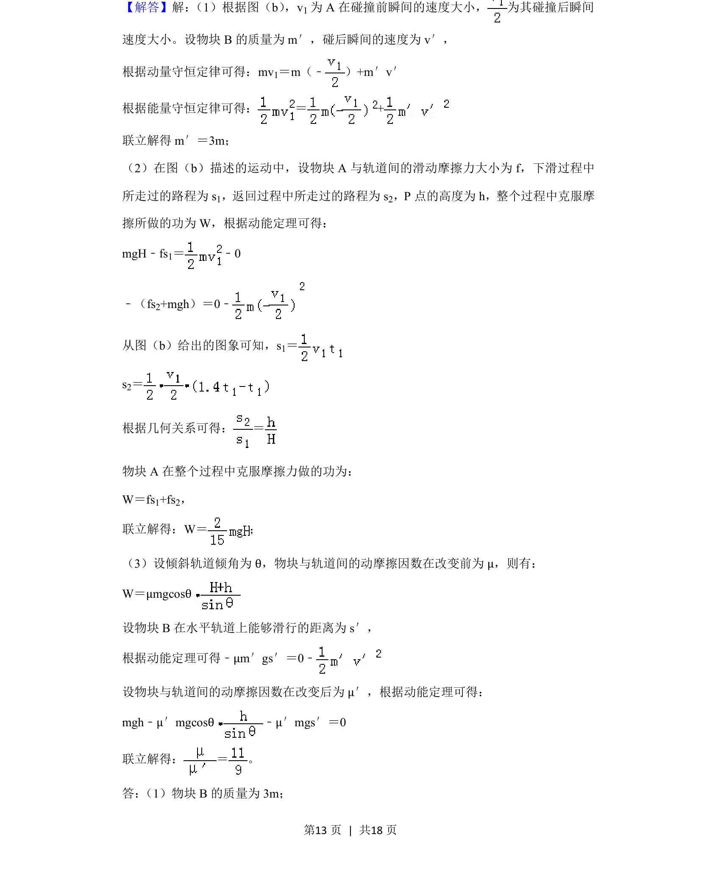
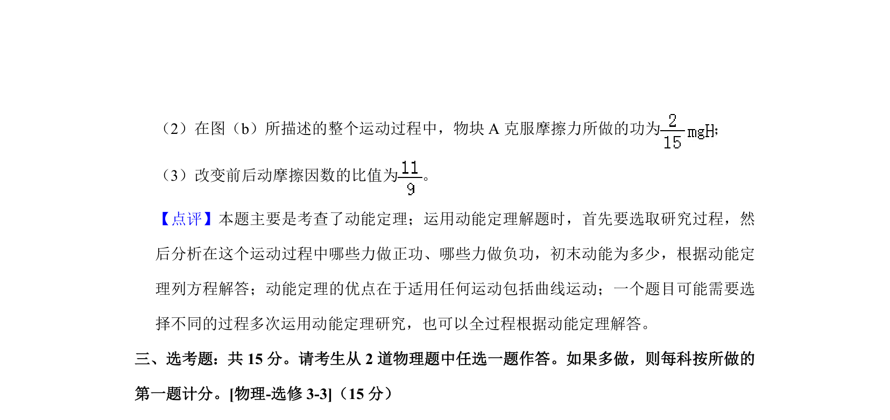

## 题面

## 摘要

小物块A、B在倾斜与水平轨道上发生弹性碰撞，结合v-t图像，运用动量守恒、动能定理求解质量、克服摩擦力做功及动摩擦因数比值。

## 关联考点

- [[359-弹性碰撞|弹性碰撞]]
- [[347-动量守恒定律|动量守恒定律]]
- [[251-动能定理|动能定理]]
- [[765-摩擦力做功|摩擦力做功]]

## 答案与解析

> 📄 原 PDF 第 12 页：`素材/真题/湖南/2008-2024·（湖南）物理高考真题/2019年高考物理试卷（新课标Ⅰ）（解析卷）.pdf`
