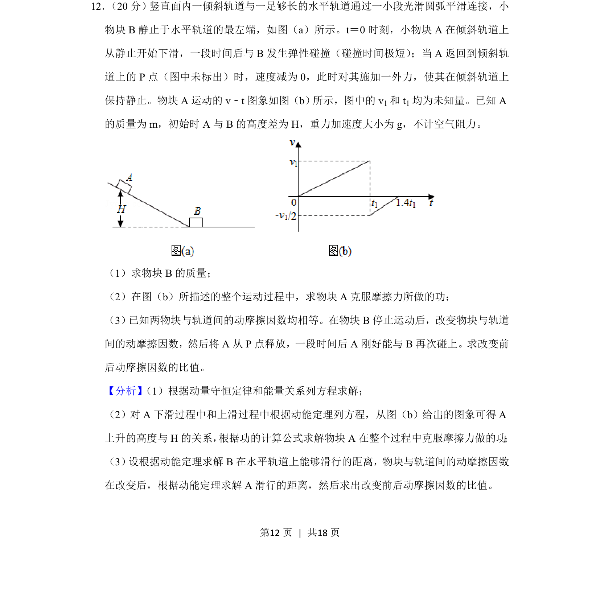
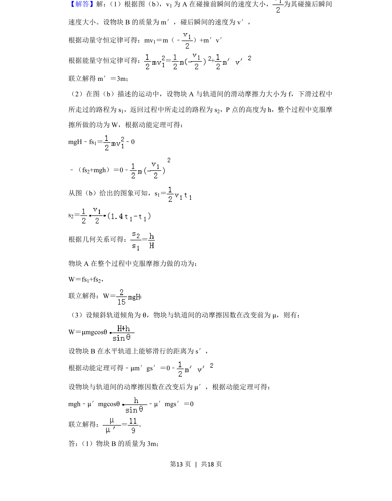
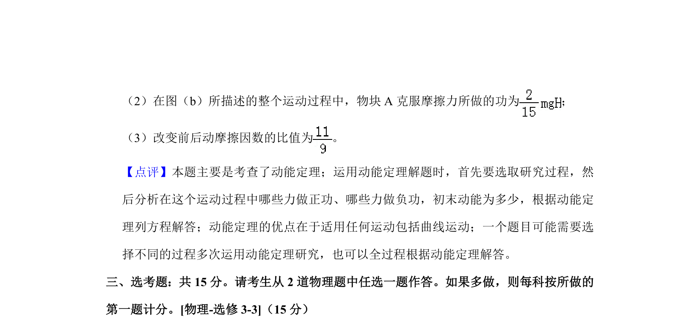

## 题面

## 摘要

小物块A、B在倾斜与水平轨道上发生弹性碰撞，结合v-t图像，运用动量守恒、动能定理求解质量、克服摩擦力做功及动摩擦因数比值。

## 关联考点

- [[359-弹性碰撞|弹性碰撞]]
- [[347-动量守恒定律|动量守恒定律]]
- [[251-动能定理|动能定理]]
- [[765-摩擦力做功|摩擦力做功]]

## 答案与解析

> 📄 原 PDF 第 12 页：`素材/真题/湖南/2008-2024·（湖南）物理高考真题/2019年高考物理试卷（新课标Ⅰ）（解析卷）.pdf`

<!-- 题干文本-start -->
## 题干文本
12． （20分）竖直面内一倾斜轨道与一足够长的水平轨道通过一小段光滑圆弧平滑连接，小
物块B静止于水平轨道的最左端，如图（a）所示。t＝0时刻，小物块A在倾斜轨道上
从静止开始下滑，一段时间后与B发生弹性碰撞（碰撞时间极短） ；当A返回到倾斜轨
道上的P点（图中未标出）时，速度减为0，此时对其施加一外力，使其在倾斜轨道上
保持静止。物块A运动的v﹣t图象如图（b） 所示，图中的v 1和t 1均为未知量。已知A
的质量为m，初始时A与B的高度差为H，重力加速度大小为g，不计空气阻力。
（1）求物块B的质量；
（2）在图（b）所描述的整个运动过程中，求物块A克服摩擦力所做的功；
（3） 已知两物块与轨道间的动摩擦因数均相等。在物块B停止运动后，改变物块与轨道
间的动摩擦因数，然后将A从P点释放，一段时间后A刚好能与B再次碰上。求改变前
后动摩擦因数的比值。
<!-- 题干文本-end -->

<!-- 解析文本-start -->
## 解析文本
【分析】 （1）根据动量守恒定律和能量关系列方程求解；
（2）对A下滑过程中和上滑过程中根据动能定理列方程，从图（b）给出的图象可得A
上升的高度与H的关系， 根据功的计算公式求解物块A在整个过程中克服摩擦力做的功 ；
（3） 设根据动能定理求解B在水平轨道上能够滑行的距离，物块与轨道间的动摩擦因数
在改变后，根据动能定理求解A滑行的距离，然后求出改变前后动摩擦因数的比值。
<!-- 解析文本-end -->
