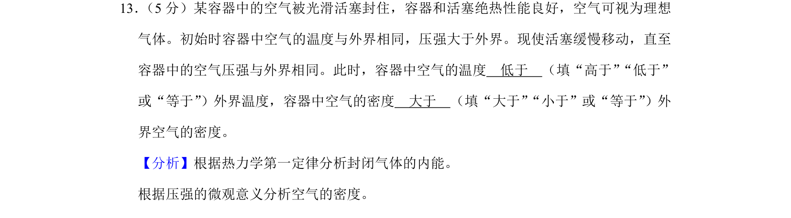
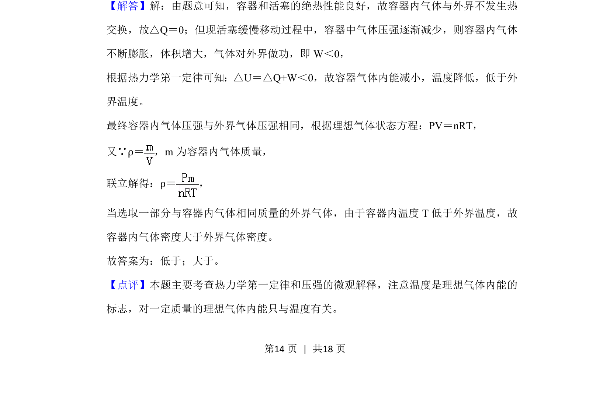

## 题面

## 摘要

容器中绝热气体膨胀对外做功，内能减小温度降低，结合状态方程比较内外密度。

## 关联考点

- [[440-热力学第一定律|热力学第一定律]]
- [[446-理想气体状态方程|理想气体状态方程]]
- [[气体密度]]
- [[绝热过程]]

## 答案与解析

> 📄 原 PDF 第 14 页：`素材/真题/湖南/2008-2024·（湖南）物理高考真题/2019年高考物理试卷（新课标Ⅰ）（解析卷）.pdf`
