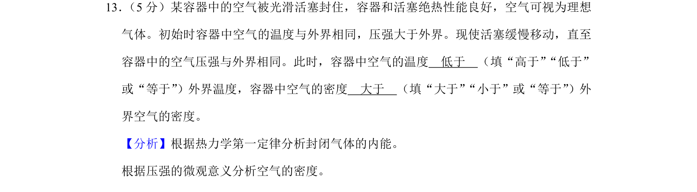
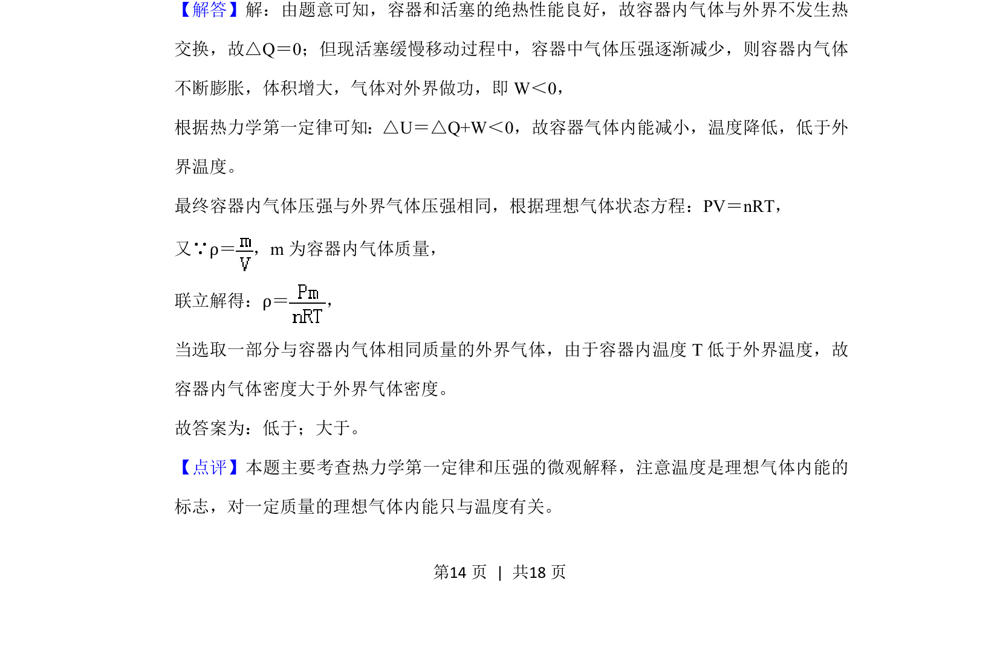

## 题面

## 摘要

容器中绝热气体膨胀对外做功，内能减小温度降低，结合状态方程比较内外密度。

## 关联考点

- [[440-热力学第一定律|热力学第一定律]]
- [[446-理想气体状态方程|理想气体状态方程]]
- [[气体密度]]
- [[绝热过程]]

## 答案与解析

> 📄 原 PDF 第 14 页：`素材/真题/湖南/2008-2024·（湖南）物理高考真题/2019年高考物理试卷（新课标Ⅰ）（解析卷）.pdf`

<!-- 题干文本-start -->
## 题干文本
13． （5分）某容器中的空气被光滑活塞封住，容器和活塞绝热性能良好，空气可视为理想
气体。初始时容器中空气的温度与外界相同，压强大于外界。现使活塞缓慢移动，直至
容器中的空气压强与外界相同。此时，容器中空气的温度　低于　（填“高于” “低于”
或“等于”）外界温度，容器中空气的密度　大于　（填“大于” “小于”或“等于”）外
界空气的密度。
<!-- 题干文本-end -->

<!-- 解析文本-start -->
## 解析文本
【分析】根据热力学第一定律分析封闭气体的内能。
根据压强的微观意义分析空气的密度。
【解答】解：由题意可知，容器和活塞的绝热性能良好，故容器内气体与外界不发生热
交换，故△Q＝0；但现活塞缓慢移动过程中，容器中气体压强逐渐减少，则容器内气体
不断膨胀，体积增大，气体对外界做功，即W＜0，
根据热力学第一定律可知：△U＝△Q+W＜0，故容器气体内能减小，温度降低，低于外
界温度。
最终容器内气体压强与外界气体压强相同，根据理想气体状态方程：PV＝nRT，
又∵ρ＝ ，m为容器内气体质量，
联立解得：ρ＝ ，
当选取一部分与容器内气体相同质量的外界气体，由于容器内温度T低于外界温度，故
容器内气体密度大于外界气体密度。
故答案为：低于；大于。
【点评】本题主要考查热力学第一定律和压强的微观解释，注意温度是理想气体内能的
标志，对一定质量的理想气体内能只与温度有关。
<!-- 解析文本-end -->
